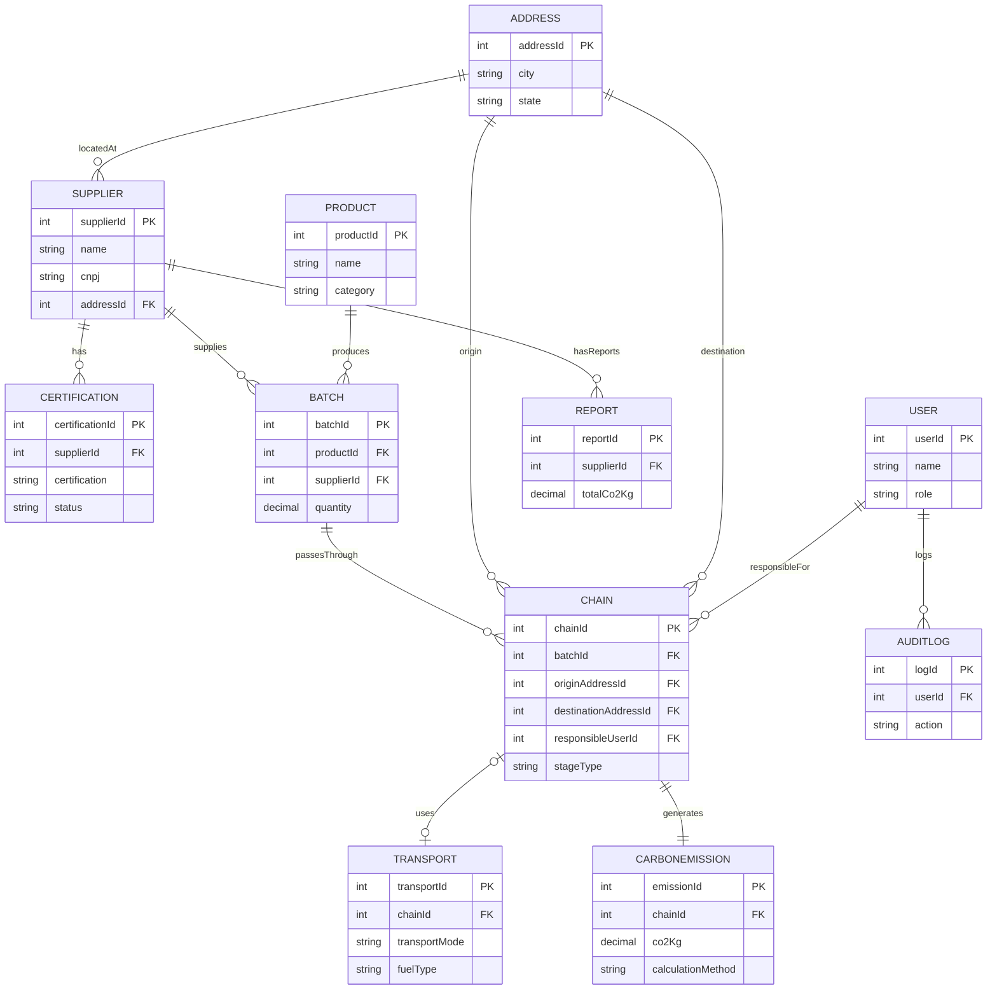

# CLAUDE.md — Backend Supply Chain Verde

> Contexto para trabalhar neste repositório. Projeto acadêmico (UC: Banco de Dados, Anhembi Morumbi) — backend de rastreabilidade de cadeias de suprimento sustentáveis.

---

## 1. Visão Geral do Projeto

**Problema:** cadeias de suprimento têm baixa rastreabilidade de origem sustentável, não medem sua pegada de carbono por etapa, e mantêm certificações ambientais fragmentadas.

**Solução:** API que rastreia cada lote de produto (`Batch`) do fornecedor ao varejo, através de etapas (`Chain`) que registram localização, transporte e emissões de CO₂, permitindo consolidar relatórios de sustentabilidade auditáveis e ranquear fornecedores por desempenho ambiental.

---

## 2. Stack Tecnológico

| Camada | Tecnologia |
|---|---|
| Linguagem | Java 25 (LTS) |
| Framework | Spring Boot |
| ORM | Hibernate / JPA |
| Migrations | Flyway (SQL puro, versionado) |
| Banco de Dados | PostgreSQL |
| Mapeamento DTO/JPA ↔ domínio | MapStruct |
| Redução de boilerplate | Lombok |
| Frontend (repositório separado) | TypeScript + Angular |

Justificativas completas de cada escolha (incluindo alternativas descartadas) estão em `decisoes-tecnicas-supply-chain-verde.md`.

---

## 3. Arquitetura: Clean Architecture

Três camadas, com a **regra da dependência**: código de fora só pode depender de código mais interno, nunca o contrário.

```
domain          ← regras de negócio puras, zero dependência de framework
   ↑
application     ← casos de uso, orquestra domain
   ↑
infrastructure  ← Spring, Hibernate, controllers, segurança — implementa interfaces do domain
```

- `domain` não importa nada de `application` nem de `infrastructure`.
- `application` só conhece `domain` (interfaces de repositório, entidades, serviços de domínio).
- `infrastructure` implementa as interfaces definidas em `domain` (ex: `SupplierRepository` é interface no domain; `SupplierRepositoryImpl` é a implementação concreta com Spring Data JPA).

---

## 4. Convenções de Código

### 4.1 Nomenclatura (herdada do modelo de dados)

| Tipo de campo | Convenção | Exemplos |
|---|---|---|
| Chave primária / estrangeira | `entityId` | `supplierId`, `batchId`, `addressId` |
| Datas / timestamps | `xAt` | `registeredAt`, `issuedAt`, `createdAt` |
| Duas FKs para a mesma entidade | prefixo descritivo + `entityId` | `originAddressId`, `destinationAddressId` |

### 4.2 Records vs. Classes

| Tipo | Implementação | Motivo |
|---|---|---|
| DTOs (`application/dto/`) | `record` | Portador de dados imutável — ganho direto de concisão. |
| Value Objects (`domain/valueobject/`) | `record`, com validação no construtor compacto | Imutabilidade é parte da definição de VO em DDD. |
| Entidades JPA (`infrastructure/persistence/jpa/`) | classe + Lombok (`@Entity @Getter @Setter @NoArgsConstructor`) | Records **não funcionam** com Hibernate: exige construtor sem args, campos mutáveis e classes não-`final` (proxies de lazy loading). |
| Entidades de domínio (`domain/entity/`) | classe + Lombok (`@Getter`/`@Builder`) | Evita verbosidade extra em updates parciais frequentes. |

### 4.3 Mappers (MapStruct)

Toda classe terminada em `Mapper` é uma **interface** anotada com `@Mapper(componentModel = "spring")` — a implementação é gerada em tempo de compilação, nunca escrita manualmente:

```java
@Mapper(componentModel = "spring")
public interface SupplierJpaMapper {
    Supplier toDomain(SupplierJpaEntity entity);
    SupplierJpaEntity toJpaEntity(Supplier domain);
}
```

**Build:** `lombok-mapstruct-binding` é obrigatório no `pom.xml`, com Lombok processado antes do MapStruct no `maven-compiler-plugin` — sem isso, os mappers gerados não enxergam os getters/setters do Lombok.

### 4.4 ENUMs

Os seguintes campos são **sempre** `ENUM` fechado, nunca `String` livre — refletem `ENUM`s reais no schema PostgreSQL:

`Certification.status`, `Product.category`, `Product.unit`, `Chain.stageType`, `User.role`, `Transport.transportMode`, `Transport.fuelType`, `CarbonEmission.calculationMethod`.

### 4.5 Auditoria

Nenhum caso de uso registra `AuditLog` manualmente. O registro acontece via `AuditLogInterceptor` (AOP, em `infrastructure/audit/`) — centraliza a auditoria e evita esquecer de logar uma ação.

---

## 5. Estrutura de Pastas

```
src/main/java/br/com/anhembi/supplychainverde/
│
├── domain/
│   ├── entity/            Supplier, Certification, Product, Batch, Address,
│   │                      Chain, Transport, CarbonEmission, Report, User, AuditLog
│   ├── enums/              CertificationStatus, ProductCategory, ProductUnit, StageType,
│   │                      TransportMode, FuelType, CalculationMethod, UserRole, AuditAction
│   ├── valueobject/        Cnpj, EmissionFactor  (record)
│   ├── repository/         uma interface por entidade (ex: SupplierRepository)
│   ├── service/            CarbonFootprintCalculator, SustainabilityScoreCalculator, PasswordHasher
│   └── exception/          DomainException (base), SupplierNotFoundException, BatchNotFoundException,
│                          CertificationExpiredException, InvalidStageTransitionException
│
├── application/
│   ├── usecase/
│   │   ├── supplier/       RegisterSupplierUseCase, UpdateSupplierUseCase, GetSupplierUseCase,
│   │   │                  ListSuppliersUseCase, RankSuppliersBySustainabilityUseCase
│   │   ├── certification/  RegisterCertificationUseCase, UpdateCertificationStatusUseCase,
│   │   │                  ListExpiringCertificationsUseCase
│   │   ├── product/        RegisterProductUseCase, UpdateProductUseCase, ListProductsUseCase
│   │   ├── batch/          RegisterBatchUseCase, GetBatchTraceabilityUseCase, ListBatchesBySupplierUseCase
│   │   ├── chain/          RegisterChainStageUseCase, ListChainStagesByBatchUseCase
│   │   ├── transport/      RegisterTransportUseCase
│   │   ├── emission/       CalculateCarbonEmissionUseCase, GetBatchCarbonFootprintUseCase
│   │   ├── report/         GenerateSustainabilityReportUseCase, GetReportUseCase, ListReportsBySupplierUseCase
│   │   ├── user/           RegisterUserUseCase, AuthenticateUserUseCase, UpdateUserRoleUseCase
│   │   └── audit/          ListAuditLogsUseCase
│   ├── dto/                (record) request/response por entidade + auth/ (LoginRequestDTO, LoginResponseDTO)
│   ├── mapper/              interfaces @Mapper — DTO ↔ domain, uma por entidade
│   └── exception/           ApplicationException (base), ValidationException, UnauthorizedActionException
│
├── infrastructure/
│   ├── web/
│   │   ├── controller/      um controller por entidade + AuthController
│   │   ├── advice/          GlobalExceptionHandler
│   │   └── config/          SwaggerConfig, CorsConfig, WebConfig
│   ├── persistence/
│   │   ├── jpa/             *JpaEntity — uma por entidade (classe + Lombok, nunca record)
│   │   ├── repository/      *JpaRepository — interfaces Spring Data
│   │   ├── repositoryimpl/  *RepositoryImpl — implementam as interfaces do domain
│   │   └── mapper/          interfaces @Mapper — JPA entity ↔ domain entity
│   ├── security/            SecurityConfig, JwtTokenProvider, JwtAuthenticationFilter,
│   │                       BcryptPasswordHasher, CustomUserDetailsService
│   ├── audit/                AuditLogInterceptor (AOP)
│   └── config/                ApplicationConfig, DataSourceConfig
│
└── SupplyChainVerdeApplication.java

src/main/resources/
├── db/migration/    V1__create_address.sql → V11__create_audit_log.sql (ordem respeita FKs)
├── application.properties
├── application-test.properties
└── .env                              (opcional — só se usado pelo Docker Compose do Postgres local; gitignored)

src/test/java/.../
├── domain/          testes unitários (calculators, value objects)     → sufixo *Test.java (Surefire, `mvn test`)
├── application/     testes de use case com mocks de repository       → sufixo *Test.java (Surefire, `mvn test`)
└── infrastructure/  testes de integração (Testcontainers + Postgres) → sufixo *IT.java (Failsafe, `mvn verify`)
```

> Lista completa arquivo-a-arquivo, com nomes de classe exatos: `estrutura-pastas-backend-java.md`.

---

---

## 6. Modelo de Dados (ERD)



> Diagrama simplificado (atributos-chave, sem `ENUM`s completos) — GitHub renderiza esse bloco Mermaid nativamente. Campos completos de cada entidade, com tipos e `ENUM`s exatos, na seção 7 (Entidades de Domínio, código Java) e em `der_supply_chain_verde.puml` / `.mmd`.

## 7. Entidades de Domínio

Classes em `domain/entity/` — Lombok (`@Getter @Setter @Builder`), campos mutáveis (permite update parcial sem reconstruir o objeto inteiro, ver seção 4.2), **nunca `record`**.

**Decisão de design**: entidades referenciam objetos de domínio relacionados diretamente (ex: `Batch.supplier` é um `Supplier`, não um `Long supplierId`) — mais expressivo pra regras de negócio navegarem o grafo sem consulta extra. O `RepositoryImpl` (infraestrutura) é responsável por resolver essas referências ao reconstruir a partir da entidade JPA. Alternativa mais leve (guardar só o ID) é válida se o time preferir evitar o risco de carregar grafos grandes sem querer — mas não é o que está documentado aqui.

```java
public class Address {
    private Long addressId;
    private String street;
    private String number;
    private String neighborhood;
    private String complement;
    private String zipCode;
    private String city;
    private String state;
}

public class User {
    private Long userId;
    private String name;
    private String email;
    private String passwordHash;
    private UserRole role;
    private LocalDateTime createdAt;
}

public class Supplier {
    private Long supplierId;
    private String name;
    private Cnpj cnpj;
    private Address address;
    private String phone;
    private LocalDate registeredAt;
}

public class Product {
    private Long productId;
    private String name;
    private ProductCategory category;
    private ProductUnit unit;
    private String description;
}

public class Certification {
    private Long certificationId;
    private Supplier supplier;
    private String certification;
    private String issuingBody;
    private LocalDate issuedAt;
    private LocalDate expiresAt;
    private CertificationStatus status;
}

public class Batch {
    private Long batchId;
    private Product product;
    private Supplier supplier;
    private BigDecimal quantity;
    private LocalDate producedAt;
}

public class Chain {
    private Long chainId;
    private Batch batch;
    private Address originAddress;      // nullable — ver pendência na seção 14
    private Address destinationAddress; // nullable — ver pendência na seção 14
    private User responsibleUser;
    private StageType stageType;
    private LocalDateTime startedAt;
    private LocalDateTime endedAt;
}

public class Transport {
    private Long transportId;
    private Chain chain;
    private TransportMode transportMode;
    private BigDecimal distance;
    private FuelType fuelType;
    private BigDecimal capacity;
}

public class CarbonEmission {
    private Long emissionId;
    private Chain chain;
    private EmissionFactor emissionFactor;
    private BigDecimal co2Kg;
    private CalculationMethod calculationMethod;
    private LocalDate calculatedAt;
}

public class Report {
    private Long reportId;
    private Supplier supplier;
    private LocalDate periodStartAt;
    private LocalDate periodEndAt;
    private BigDecimal totalCo2Kg;
    private Integer trackedProductCount;
    private LocalDateTime generatedAt;
}

public class AuditLog {
    private Long logId;
    private User user;
    private AuditAction action;
    private String affectedTable;
    private LocalDateTime performedAt;
}
```

**Notas específicas:**
- `User.passwordHash` guarda só o hash (Bcrypt, ver seção 9.1) — a senha em texto puro nunca é mantida em nenhuma entidade, existe apenas transitoriamente no `UserRequestDTO`/`LoginRequestDTO` até ser processada.
- `Supplier.cnpj` usa o value object `Cnpj` (não `String`), validado no próprio construtor compacto (seção 4.2).
- `CarbonEmission.emissionFactor` usa o value object `EmissionFactor`, não um `BigDecimal` cru — encapsula valor + unidade de referência.
- Nenhuma entidade tem campo de score de sustentabilidade ou código de rastreamento — ambos são calculados em tempo de execução (regras de negócio 2 e 3, seção 11), nunca persistidos.

---

## 8. Casos de Uso

| Caso de Uso | Descrição |
|---|---|
| `RegisterSupplierUseCase` | Cadastra fornecedor, vinculando a um `Address`. |
| `UpdateSupplierUseCase` | Atualiza dados cadastrais do fornecedor. |
| `GetSupplierUseCase` / `ListSuppliersUseCase` | Consulta fornecedor(es). |
| `RankSuppliersBySustainabilityUseCase` | Calcula o score de sustentabilidade **sob demanda** (não persistido) a partir de `Certification` + `CarbonEmission`, e retorna fornecedores ranqueados. |
| `RegisterCertificationUseCase` | Registra certificação ambiental de um fornecedor. |
| `UpdateCertificationStatusUseCase` | Atualiza o status (`active`, `expired`, `suspended`, `underReview`). |
| `ListExpiringCertificationsUseCase` | Lista certificações próximas do vencimento. |
| `RegisterProductUseCase` / `UpdateProductUseCase` / `ListProductsUseCase` | CRUD de produtos. |
| `RegisterBatchUseCase` | Registra um novo lote, vinculado a `Product` e `Supplier`. |
| `GetBatchTraceabilityUseCase` | Endpoint público acessado via QR Code — recebe `batchId` e retorna toda a jornada do lote (etapas, transporte, emissões). |
| `ListBatchesBySupplierUseCase` | Lista lotes de um fornecedor. |
| `RegisterChainStageUseCase` | Registra uma nova etapa (`Chain`) na jornada do lote — produção, armazenagem, transporte, distribuição ou varejo. |
| `ListChainStagesByBatchUseCase` | Lista as etapas percorridas por um lote, em ordem. |
| `RegisterTransportUseCase` | Registra os dados de transporte de uma etapa (modal, distância, combustível). |
| `CalculateCarbonEmissionUseCase` | Calcula e registra a emissão de CO₂ de uma etapa, usando o fator de emissão vigente na metodologia escolhida. |
| `GetBatchCarbonFootprintUseCase` | Soma as emissões de todas as etapas de um lote — pegada de carbono total. |
| `GenerateSustainabilityReportUseCase` | Consolida emissões e certificações de um fornecedor num período, gerando um `Report`. |
| `GetReportUseCase` / `ListReportsBySupplierUseCase` | Consulta relatório(s). |
| `RegisterUserUseCase` | Cria usuário do sistema, com `role` definida. |
| `AuthenticateUserUseCase` | Login — valida credenciais e emite token JWT. |
| `UpdateUserRoleUseCase` | Altera o perfil de acesso de um usuário. |
| `ListAuditLogsUseCase` | Consulta o histórico de ações registradas (populado automaticamente via AOP, nunca chamado para escrever). |

---

## 9. Rotas da API

### 9.1 Autenticação

- Modelo: **JWT stateless** — sem sessão guardada no servidor.
- Fluxo:
  1. Cliente envia `POST /api/v1/auth/login` com `email` + `password`.
  2. `AuthenticateUserUseCase` valida a senha (hash comparado via `BcryptPasswordHasher`) e, se correta, `JwtTokenProvider` emite um token assinado com `userId`, `email` e `role` como claims.
  3. Cliente passa a enviar o token em toda requisição protegida: header `Authorization: Bearer <token>`.
  4. `JwtAuthenticationFilter` intercepta a requisição, valida assinatura e expiração do token, e popula o contexto de segurança do Spring com o `role` do usuário.
  5. Controllers restringem acesso por perfil com `@PreAuthorize("hasRole('ADMIN')")` (ou equivalente), conferido contra o `role` do token.
- Expiração do token controlada por `JWT_EXPIRATION_MS` (ver seção 12). **Sem refresh token implementado** — decisão em aberto (ver seção 14).
- Duas rotas são **públicas** (sem token, por design): login, e a consulta de rastreabilidade/pegada de carbono via QR Code — o objetivo é transparência pública da jornada do lote.

### 9.2 Convenções Gerais

- Base path: `/api/v1`
- `Content-Type: application/json` em todas as rotas.
- Coluna **Acesso**: `Público` (sem token) · `Autenticado` (qualquer `role` válida) · ou a lista de `role`s permitidas.

### 9.3 Endpoints

**Auth**

| Verbo | Endpoint | Request | Response | Acesso |
|---|---|---|---|---|
| POST | `/api/v1/auth/login` | `LoginRequestDTO` | `LoginResponseDTO` | Público |

**User**

| Verbo | Endpoint | Request | Response | Acesso |
|---|---|---|---|---|
| POST | `/api/v1/users` | `UserRequestDTO` | `UserResponseDTO` | `admin` |
| GET | `/api/v1/users/me` | — | `UserResponseDTO` | Autenticado |
| PATCH | `/api/v1/users/{userId}/role` | `{ role }` | `UserResponseDTO` | `admin` |

**Supplier**

| Verbo | Endpoint | Request | Response | Acesso |
|---|---|---|---|---|
| POST | `/api/v1/suppliers` | `SupplierRequestDTO` | `SupplierResponseDTO` | `admin`, `manager` |
| PUT | `/api/v1/suppliers/{supplierId}` | `SupplierRequestDTO` | `SupplierResponseDTO` | `admin`, `manager` |
| GET | `/api/v1/suppliers/{supplierId}` | — | `SupplierResponseDTO` | Autenticado |
| GET | `/api/v1/suppliers` | — | `List<SupplierResponseDTO>` | Autenticado |
| GET | `/api/v1/suppliers/ranking` | — | `List<SupplierRankingDTO>` | Autenticado |

**Certification**

| Verbo | Endpoint | Request | Response | Acesso |
|---|---|---|---|---|
| POST | `/api/v1/suppliers/{supplierId}/certifications` | `CertificationRequestDTO` | `CertificationResponseDTO` | `supplier`, `admin` |
| PATCH | `/api/v1/certifications/{certificationId}/status` | `{ status }` | `CertificationResponseDTO` | `auditor`, `admin` |
| GET | `/api/v1/certifications/expiring` | — | `List<CertificationResponseDTO>` | `auditor`, `manager`, `admin` |

**Product**

| Verbo | Endpoint | Request | Response | Acesso |
|---|---|---|---|---|
| POST | `/api/v1/products` | `ProductRequestDTO` | `ProductResponseDTO` | `admin`, `manager` |
| PUT | `/api/v1/products/{productId}` | `ProductRequestDTO` | `ProductResponseDTO` | `admin`, `manager` |
| GET | `/api/v1/products` | — | `List<ProductResponseDTO>` | Autenticado |

**Batch**

| Verbo | Endpoint | Request | Response | Acesso |
|---|---|---|---|---|
| POST | `/api/v1/batches` | `BatchRequestDTO` | `BatchResponseDTO` | `supplier`, `admin` |
| GET | `/api/v1/batches/{batchId}/traceability` | — | `BatchTraceabilityResponseDTO` | **Público** (QR Code) |
| GET | `/api/v1/suppliers/{supplierId}/batches` | — | `List<BatchResponseDTO>` | Autenticado |

**Chain**

| Verbo | Endpoint | Request | Response | Acesso |
|---|---|---|---|---|
| POST | `/api/v1/batches/{batchId}/stages` | `ChainRequestDTO` | `ChainResponseDTO` | `supplier`, `manager`, `admin` |
| GET | `/api/v1/batches/{batchId}/stages` | — | `List<ChainResponseDTO>` | Autenticado |

**Transport**

| Verbo | Endpoint | Request | Response | Acesso |
|---|---|---|---|---|
| POST | `/api/v1/stages/{chainId}/transport` | `TransportRequestDTO` | `TransportResponseDTO` | `supplier`, `manager`, `admin` |

**CarbonEmission**

| Verbo | Endpoint | Request | Response | Acesso |
|---|---|---|---|---|
| POST | `/api/v1/stages/{chainId}/emission` | `CarbonEmissionRequestDTO` | `CarbonEmissionResponseDTO` | `manager`, `admin` |
| GET | `/api/v1/batches/{batchId}/carbon-footprint` | — | `CarbonFootprintResponseDTO` | **Público** (QR Code) |

**Report**

| Verbo | Endpoint | Request | Response | Acesso |
|---|---|---|---|---|
| POST | `/api/v1/suppliers/{supplierId}/reports` | `ReportRequestDTO` | `ReportResponseDTO` | `auditor`, `manager`, `admin` |
| GET | `/api/v1/reports/{reportId}` | — | `ReportResponseDTO` | `auditor`, `manager`, `admin`, `supplier` (dono) |
| GET | `/api/v1/suppliers/{supplierId}/reports` | — | `List<ReportResponseDTO>` | `auditor`, `manager`, `admin`, `supplier` (dono) |

**AuditLog**

| Verbo | Endpoint | Request | Response | Acesso |
|---|---|---|---|---|
| GET | `/api/v1/audit-logs` | — | `List<AuditLogResponseDTO>` | `admin`, `auditor` |

> Três DTOs citados aqui não estavam na lista original de arquivos e foram adicionados em `estrutura-pastas-backend-java.md`: `CarbonEmissionRequestDTO`, `CarbonFootprintResponseDTO` e `SupplierRankingDTO`.

---

## 10. Contratos (DTOs)

Definições completas dos DTOs referenciados na seção 9, como `record` (ver seção 4.2). Convenções gerais:

- Endpoints de listagem (`GET` que retornam array) aceitam `page` e `size` como query params — omitidos abaixo por serem transversais.
- `responsibleUserId` (em `Chain`) e `userId` (em `AuditLog`) **nunca vêm no corpo da requisição** — são preenchidos a partir do usuário autenticado no token JWT, nunca informados pelo cliente (evita que alguém registre uma ação em nome de outro usuário).
- `emissionFactor` e `co2Kg` **nunca vêm no corpo da requisição** de `CarbonEmission` — são calculados por `CarbonFootprintCalculator` a partir dos dados de `Transport` da etapa e da metodologia escolhida.
- Tipos seguem o modelo de dados: `DATE` → `LocalDate`, `DATETIME` → `LocalDateTime`, `DECIMAL` → `BigDecimal`.

### 10.1 Auth

```java
public record LoginRequestDTO(
    String email,
    String password
) {}

public record LoginResponseDTO(
    String token,
    LocalDateTime expiresAt,
    UserRole role
) {}
```

### 10.2 User

```java
public record UserRequestDTO(
    String name,
    String email,
    String password,
    UserRole role
) {}

public record UserResponseDTO(
    Long userId,
    String name,
    String email,
    UserRole role,
    LocalDateTime createdAt
) {}

public record UpdateUserRoleRequestDTO(
    UserRole role
) {}
```

### 10.3 Address (compartilhado por Supplier e Chain)

```java
public record AddressRequestDTO(
    String street,
    String number,
    String neighborhood,
    String complement,
    String zipCode,
    String city,
    String state
) {}

public record AddressResponseDTO(
    Long addressId,
    String street,
    String number,
    String neighborhood,
    String complement,
    String zipCode,
    String city,
    String state
) {}
```

### 10.4 Supplier

```java
public record SupplierRequestDTO(
    String name,
    String cnpj,
    AddressRequestDTO address,
    String phone
) {}

public record SupplierResponseDTO(
    Long supplierId,
    String name,
    String cnpj,
    AddressResponseDTO address,
    String phone,
    LocalDate registeredAt
) {}

public record SupplierRankingDTO(
    Long supplierId,
    String name,
    BigDecimal sustainabilityScore,
    Integer activeCertificationCount,
    BigDecimal totalCo2Kg
) {}
```

### 10.5 Certification

```java
public record CertificationRequestDTO(
    Long supplierId,
    String certification,
    String issuingBody,
    LocalDate issuedAt,
    LocalDate expiresAt
) {}

public record CertificationResponseDTO(
    Long certificationId,
    Long supplierId,
    String certification,
    String issuingBody,
    LocalDate issuedAt,
    LocalDate expiresAt,
    CertificationStatus status
) {}

public record UpdateCertificationStatusRequestDTO(
    CertificationStatus status
) {}
```

### 10.6 Product

```java
public record ProductRequestDTO(
    String name,
    ProductCategory category,
    ProductUnit unit,
    String description
) {}

public record ProductResponseDTO(
    Long productId,
    String name,
    ProductCategory category,
    ProductUnit unit,
    String description
) {}
```

### 10.7 Batch

```java
public record BatchRequestDTO(
    Long productId,
    Long supplierId,
    BigDecimal quantity,
    LocalDate producedAt
) {}

public record BatchResponseDTO(
    Long batchId,
    Long productId,
    String productName,
    Long supplierId,
    String supplierName,
    BigDecimal quantity,
    LocalDate producedAt
) {}

public record BatchTraceabilityResponseDTO(
    Long batchId,
    String productName,
    String supplierName,
    BigDecimal quantity,
    LocalDate producedAt,
    List<ChainResponseDTO> stages,
    BigDecimal totalCo2Kg
) {}
```

### 10.8 Chain

```java
public record ChainRequestDTO(
    Long batchId,
    Long originAddressId,      // opcional/nullable — ver pendência na seção 14
    Long destinationAddressId, // opcional/nullable — ver pendência na seção 14
    StageType stageType,
    LocalDateTime startedAt,
    LocalDateTime endedAt
) {}

public record ChainResponseDTO(
    Long chainId,
    Long batchId,
    AddressResponseDTO originAddress,      // pode ser null
    AddressResponseDTO destinationAddress, // pode ser null
    Long responsibleUserId,
    String responsibleUserName,
    StageType stageType,
    LocalDateTime startedAt,
    LocalDateTime endedAt,
    TransportResponseDTO transport,        // pode ser null — nem toda etapa tem transporte
    CarbonEmissionResponseDTO emission
) {}
```

### 10.9 Transport

```java
public record TransportRequestDTO(
    Long chainId,
    TransportMode transportMode,
    BigDecimal distance,
    FuelType fuelType,
    BigDecimal capacity
) {}

public record TransportResponseDTO(
    Long transportId,
    Long chainId,
    TransportMode transportMode,
    BigDecimal distance,
    FuelType fuelType,
    BigDecimal capacity
) {}
```

### 10.10 CarbonEmission

```java
public record CarbonEmissionRequestDTO(
    Long chainId,
    CalculationMethod calculationMethod
) {}

public record CarbonEmissionResponseDTO(
    Long emissionId,
    Long chainId,
    BigDecimal emissionFactor,
    BigDecimal co2Kg,
    CalculationMethod calculationMethod,
    LocalDate calculatedAt
) {}

public record CarbonFootprintResponseDTO(
    Long batchId,
    BigDecimal totalCo2Kg,
    List<CarbonEmissionResponseDTO> emissionsByStage
) {}
```

### 10.11 Report

```java
public record ReportRequestDTO(
    Long supplierId,
    LocalDate periodStartAt,
    LocalDate periodEndAt
) {}

public record ReportResponseDTO(
    Long reportId,
    Long supplierId,
    LocalDate periodStartAt,
    LocalDate periodEndAt,
    BigDecimal totalCo2Kg,
    Integer trackedProductCount,
    LocalDateTime generatedAt
) {}
```

### 10.12 AuditLog

```java
public record AuditLogResponseDTO(
    Long logId,
    Long userId,
    AuditAction action,
    String affectedTable,
    LocalDateTime performedAt
) {}
```

---

## 11. Regras de Negócio

1. **Toda etapa da cadeia (`Chain`) exige um usuário responsável** (`responsibleUserId`, FK obrigatória para `User`) — nenhuma etapa pode ser registrada sem rastreabilidade de quem a executou/autorizou.
2. **O score de sustentabilidade do fornecedor não é armazenado.** É sempre calculado dinamicamente por `RankSuppliersBySustainabilityUseCase`, a partir de certificações válidas e emissões acumuladas — evita dado derivado desatualizado no banco.
3. **Não existe código de rastreamento armazenado em `Batch`.** O QR Code de rastreabilidade pública aponta diretamente para `batchId`; a resolução acontece via `GetBatchTraceabilityUseCase`.
4. **Toda ação relevante do sistema é auditada automaticamente** via `AuditLogInterceptor` — nenhum caso de uso deve registrar log manualmente.
5. **Endereços não são texto livre duplicado.** `Supplier` (sede) e `Chain` (origem/destino) sempre referenciam `Address` por FK — nunca armazenam rua/cidade/CEP como string solta.
6. **Toda emissão de carbono registra a metodologia usada** (`calculationMethod`) e o fator de emissão vigente no momento do cálculo (`emissionFactor`) — histórico não é recalculado retroativamente se a tabela de referência de fatores mudar no futuro, para preservar auditabilidade.
7. **Campos com conjunto fechado de valores usam `ENUM`, nunca `String` livre** (ver seção 4.4) — reduz erro de digitação e mantém consistência com o schema do banco.
8. **Perfis de acesso (`User.role`) controlam autorização**: `admin`, `auditor`, `supplier`, `manager`. Endpoints sensíveis (ex: alterar status de certificação, gerar relatório) devem validar o perfil do usuário autenticado.
9. **Risco de segurança conhecido:** como `batchId` é exposto publicamente via QR Code, há risco de enumeração de IDs (IDOR) se for um `INT` sequencial previsível. Mitigação a decidir no Plano de Segurança: rate limiting no endpoint público, ou expor um `UUID` público mantendo o `INT` interno só para joins.

---

## 12. Variáveis de Ambiente

| Variável | Descrição | Exemplo |
|---|---|---|
| `SPRING_PROFILES_ACTIVE` | Perfil ativo do Spring | `dev` / `test` / `prod` |
| `SERVER_PORT` | Porta da API | `8080` |
| `SPRING_DATASOURCE_URL` | URL de conexão JDBC do PostgreSQL | `jdbc:postgresql://localhost:5432/supply_chain_verde` |
| `SPRING_DATASOURCE_USERNAME` | Usuário do banco | `postgres` |
| `SPRING_DATASOURCE_PASSWORD` | Senha do banco | *(secreto)* |
| `JWT_SECRET` | Chave de assinatura dos tokens JWT | *(secreto, mínimo 256 bits)* |
| `JWT_EXPIRATION_MS` | Validade do token em milissegundos | `3600000` (1h) |
| `CORS_ALLOWED_ORIGINS` | Origem(ns) permitida(s) para o frontend Angular | `http://localhost:4200` |
| `FLYWAY_ENABLED` | Habilita execução automática das migrations ao subir a aplicação | `true` |

### Estratégia: placeholders com default no `application.properties`

`application.properties` (commitado) referencia cada variável com a sintaxe `${VAR:default}` — o Spring usa o valor real da variável de ambiente se ela existir, e cai no default (segundo argumento) se não existir:

```properties
# Valores com default seguro para rodar localmente sem configurar nada:
server.port=${SERVER_PORT:8080}
spring.datasource.url=${SPRING_DATASOURCE_URL:jdbc:postgresql://localhost:5432/supply_chain_verde}
spring.datasource.username=${SPRING_DATASOURCE_USERNAME:postgres}
jwt.expiration-ms=${JWT_EXPIRATION_MS:3600000}
cors.allowed-origins=${CORS_ALLOWED_ORIGINS:http://localhost:4200}
flyway.enabled=${FLYWAY_ENABLED:true}

# Segredos reais — SEM default. Se a variável não existir, o Spring recusa
# subir a aplicação (fail-fast), em vez de rodar com um valor previsível:
spring.datasource.password=${SPRING_DATASOURCE_PASSWORD}
jwt.secret=${JWT_SECRET}
```

Em desenvolvimento local, `SPRING_DATASOURCE_PASSWORD` e `JWT_SECRET` precisam ser exportados no shell, definidos na configuração de execução da IDE, ou passados via `env_file` do Docker Compose (para quem já for rodar o Postgres local via Compose). Em produção/CI, as mesmas variáveis vêm da plataforma de deploy (Kubernetes Secrets, secrets do CI/CD, etc.) — nenhum valor secreto é commitado em nenhum arquivo do repositório.

---

## 13. Comandos Úteis

```bash
# Build
mvn clean install

# Rodar a aplicação localmente
mvn spring-boot:run

# Rodar migrations Flyway manualmente
mvn flyway:migrate

# Rodar testes
mvn test

# Rodar apenas testes de integração
mvn verify -Pintegration-test
```

---

## 14. Decisões em Aberto

- **`Chain.originAddressId` / `destinationAddressId`**: ainda não decidido se são obrigatórios ou opcionais (nullable). Recomendação registrada em `decisoes-tecnicas-supply-chain-verde.md`: tornar ambos **nullable**, já que nem toda etapa tem as duas pontas preenchidas (ex: produção não tem "origem" anterior).
- **Estratégia de refresh token**: hoje o JWT expira e o usuário precisa logar novamente; decidir se vale a pena implementar refresh token para melhorar a experiência sem comprometer segurança.
- **Plano de Segurança formal** (perfis de acesso, backup, recuperação de desastres, monitoramento) — entregável do edital ainda não escrito como documento próprio.
- **Proposta de Arquitetura de Dados** (diagrama formal com fontes de dados, backend/API, frontend) — entregável do edital ainda não desenhado como diagrama.
- **Cronograma consolidado** e **trilha Oracle Academy** — a documentar em `README.md`.

---

*Referências: `decisoes-tecnicas-supply-chain-verde.md` (decisões e justificativas), `estrutura-pastas-backend-java.md` (lista completa de arquivos), `der_supply_chain_verde.puml` / `.mmd` (modelo de dados completo).*