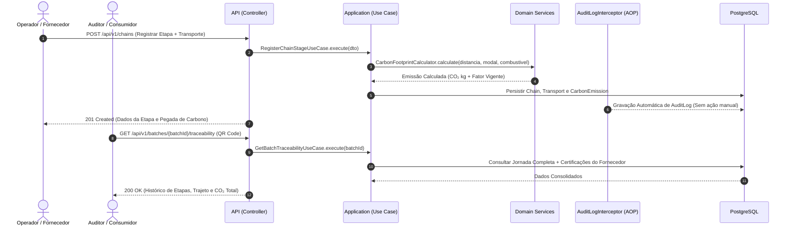

# 🌱 Supply Chain Verde — API de Rastreabilidade & Sustentabilidade


> Rastreabilidade de lotes, mensuração de emissões de CO₂ e auditoria contínua para cadeias de suprimento sustentáveis.

A **Supply Chain Verde API** é uma solução backend de alta confiabilidade desenvolvida em **Java 25** e **Spring Boot**, estruturada sob os pilares da **Clean Architecture** e **Domain-Driven Design (DDD)**. O sistema rastreia cada lote de produto (`Batch`) desde a sua origem primária até o varejo através de etapas logísticas e produtivas (`Chain`), calculando emissões de gases de efeito estufa por transporte/processamento, validando certificações ambientais e gerando relatórios auditáveis com ranking dinâmico de fornecedores.



---

## ✨ O Problema
Cadeias de suprimento modernas enfrentam graves desafios de governança e sustentabilidade:
- **Baixa Rastreabilidade**: Origem fragmentada de insumos e matérias-primas sem histórico contínuo da jornada do produto.
- **Greenwashing & Falta de Auditoria**: Certificações ambientais dispersas em PDFs sem verificação automática de validade ou expiração.
- **Cálculos de Carbono Inconsistentes**: Falta de padronização nas métricas de emissão de CO₂ e inexistência de registro do fator de emissão no momento do transporte.
- **Opacidade para o Consumidor**: Dificuldade do consumidor final em auditar a procedência socioambiental do produto na gôndola.

---

## 🚀 A Solução
A API Supply Chain Verde centraliza e orquestra a cadeia de suprimentos sustentável:
- **Rastreamento Granular por Lote (`Batch`)**: Cada lote é acompanhado através de etapas encadeadas (`Chain`), registrando localizações geográficas, operadores responsáveis e tempos de ciclo.
- **Cálculo de Emissão Confiável**: Emissões calculadas por modais e combustíveis com fixação da metodologia e fator de emissão vigente para auditoria contábil retroativa imutável.
- **Validação de Certificações**: Monitoramento proativo de certificações ativas, vencidas ou suspensas de fornecedores.
- **Ranking Dinâmico de Sustentabilidade**: Cálculo de score sob demanda com base em certificações ativas e histórico de emissões, evitando dados derivados desatualizados no banco.
- **Auditoria Automática**: Captura transversal via AOP (`AuditLogInterceptor`), garantindo trilha de auditoria para todas as operações críticas.

---

## 🎯 Diferenciais
- **Clean Architecture Pura**: Camada de domínio agnóstica a frameworks e bibliotecas externas.
- **Auditoria Transversal Zero-Boilerplate**: Nenhum caso de uso manipula logs de auditoria manualmente; o `AuditLogInterceptor` (AOP) cuida da persistência automática.
- **Imutabilidade Histórica de Emissões**: Mudanças em tabelas de referência de emissão não afetam registros históricos passados, garantindo conformidade com normas ESG.
- **Rastreabilidade Pública via QR Code**: Endpoint aberto e otimizado para consulta da árvore genealógica e pegada de carbono do lote.
- **Configuração Sem Arquivos `.env`**: Configuração centralizada em `application.properties` utilizando placeholders flexíveis (`${VAR:default}`), pronta para rodar localmente ou em contêineres sem necessidade de arquivos `.env`.

---

## 🛠️ Stack Tecnológica

| Camada | Tecnologia |
|---|---|
| **Linguagem** | Java 25 (LTS) |
| **Framework** | Spring Boot 4.1.x (WebMVC, Data JPA, Security, Validation, Actuator) |
| **Banco de Dados** | PostgreSQL 17 |
| **Database Migrations** | Flyway (SQL versionado puro) |
| **Mapeamento Objeto-Objeto** | MapStruct 1.6.3 |
| **Segurança & Tokens** | Spring Security + JJWT 0.12.6 (HMAC-SHA256) |
| **Boilerplate Reduction** | Project Lombok |
| **Testes** | JUnit 5, Mockito, Testcontainers (PostgreSQL) |
| **Containerização** | Docker & Docker Compose |

---

## 🏛️ Arquitetura (Clean Architecture)

O projeto segue estritamente a **Regra da Dependência**: classes de camadas externas apontam para dentro; a camada de Domínio desconhece infraestrutura, banco de dados e frameworks.

```
domain          ← Regras de negócio puras, Entidades, Enums, Value Objects e Interfaces de Repositório
   ↑
application     ← Casos de Uso (orquestração), DTOs (records) e Mappers de Aplicação
   ↑
infrastructure  ← Spring Boot, Hibernate/JPA, Controllers REST, Migrations Flyway, Segurança JWT, AOP
```

### Principais Entidades de Domínio
- **`Supplier`**: Fornecedores cadastrados com CNPJ validado e sede em `Address`.
- **`Certification`**: Certificações ambientais vinculadas a fornecedores com ciclo de validade.
- **`Product` & `Batch`**: Produtos e seus lotes físicos identificáveis.
- **`Chain`**: Etapas da cadeia (produção, armazenagem, transporte, distribuição, varejo) com `User` responsável obrigatório.
- **`Transport` & `CarbonEmission`**: Dados de frete (modal, combustível, distância) e cálculo de CO₂ emitido.
- **`Report`**: Relatórios consolidados de sustentabilidade para órgãos reguladores e auditorias.
- **`AuditLog`**: Registros de auditoria gerados automaticamente para compliance.

---

## 📁 Estrutura do Projeto

```text
src/main/java/br/com/anhembi/supplychainverde/
│
├── domain/                      # Camada de Domínio (Zero dependências externas)
│   ├── entity/                  # Entidades de negócio ricas
│   ├── enums/                   # Enums tipados (StageType, TransportMode, etc.)
│   ├── valueobject/             # Records com validação compacta (Cnpj, EmissionFactor)
│   ├── repository/              # Interfaces puras de persistência
│   ├── service/                 # Serviços de domínio (Calculators, Hasher interface)
│   └── exception/               # Exceções de domínio
│
├── application/                 # Camada de Aplicação (Casos de Uso)
│   ├── usecase/                 # Classes UseCase com método execute()
│   ├── dto/                     # Records imutáveis de Request e Response
│   ├── mapper/                  # Mappers MapStruct (DTO ↔ Domínio)
│   └── exception/               # Exceções da aplicação
│
├── infrastructure/              # Camada de Infraestrutura (Frameworks & Drivers)
│   ├── web/                     # Controllers REST, ExceptionHandler e Configs Web
│   ├── persistence/             # JPA Entities, Repositories Spring Data e Mappers JPA
│   ├── security/                # JWT Provider, Filtro, BCrypt e SecurityConfig
│   ├── audit/                   # Interceptor AOP para auditoria automática
│   └── config/                  # Beans de configuração da aplicação
│
└── SupplyChainVerdeApplication.java
```

---

## ⚡ Quick Start (com Docker Compose)

### Pré-requisitos
- [Docker & Docker Compose](https://www.docker.com/) instalado
- [JDK 25](https://jdk.java.net/25/) instalado (ou utilize o wrapper Maven incluso)

### 1. Clonar o repositório
```bash
git clone https://github.com/matheusnascimentods/supply-chain-verde-api.git
cd supply-chain-verde-api
```

### 2. Subir o Banco de Dados PostgreSQL
O projeto disponibiliza um `docker-compose.yml` pré-configurado:
```bash
docker compose up -d
```
Isso iniciará o PostgreSQL na porta `5432` com o banco `supply_chain_verde`.

### 3. Executar a Aplicação
```bash
./mvnw spring-boot:run
```

A API estará disponível em: **`http://localhost:8080`**

---

## 💻 Comandos Úteis de Desenvolvimento

```bash
# Compilar o projeto e processar anotações (Lombok + MapStruct)
./mvnw clean compile

# Rodar todos os testes unitários e de integração (com Testcontainers)
./mvnw test

# Empacotar artefato JAR final
./mvnw clean package

# Parar o banco de dados Docker
docker compose down

# Parar o banco de dados Docker removendo volumes de dados
docker compose down -v
```

---

## 🔌 API Reference (Principais Recursos)

### 🔐 Autenticação (`/api/v1/auth`)
| Método | Rota | Descrição | Acesso |
| :--- | :--- | :--- | :--- |
| `POST` | `/api/v1/auth/login` | Autenticação e emissão do token JWT | Público |

### 🏢 Fornecedores (`/api/v1/suppliers`)
| Método | Rota | Descrição | Acesso |
| :--- | :--- | :--- | :--- |
| `POST` | `/api/v1/suppliers` | Cadastro de novo fornecedor | `ADMIN`, `MANAGER` |
| `GET` | `/api/v1/suppliers` | Listagem de fornecedores cadastrados | Autenticado |
| `GET` | `/api/v1/suppliers/ranking` | Ranking dinâmico por sustentabilidade | Autenticado |
| `GET` | `/api/v1/suppliers/{id}` | Detalhes do fornecedor | Autenticado |
| `PUT` | `/api/v1/suppliers/{id}` | Atualização de dados cadastrais | `ADMIN`, `MANAGER` |

### 📜 Certificações (`/api/v1/certifications`)
| Método | Rota | Descrição | Acesso |
| :--- | :--- | :--- | :--- |
| `POST` | `/api/v1/certifications` | Registro de certificação ambiental | `ADMIN`, `AUDITOR` |
| `PATCH` | `/api/v1/certifications/{id}/status` | Atualização do status da certificação | `ADMIN`, `AUDITOR` |
| `GET` | `/api/v1/certifications/expiring` | Consulta de certificações a expirar | `AUDITOR`, `MANAGER` |

### 📦 Lotes & Rastreabilidade (`/api/v1/batches`)
| Método | Rota | Descrição | Acesso |
| :--- | :--- | :--- | :--- |
| `POST` | `/api/v1/batches` | Criação de novo lote de produto | `SUPPLIER`, `MANAGER` |
| `GET` | `/api/v1/batches/{id}/traceability` | Jornada completa do lote (QR Code) | **Público** |
| `GET` | `/api/v1/batches/by-supplier/{supplierId}` | Listagem de lotes por fornecedor | Autenticado |

### 🔗 Etapas da Cadeia (`/api/v1/chains`)
| Método | Rota | Descrição | Acesso |
| :--- | :--- | :--- | :--- |
| `POST` | `/api/v1/chains` | Registro de nova etapa na cadeia | Autenticado |
| `GET` | `/api/v1/chains/by-batch/{batchId}` | Etapas percorridas pelo lote em ordem | Autenticado |

### 🌿 Emissões de Carbono (`/api/v1/emissions`)
| Método | Rota | Descrição | Acesso |
| :--- | :--- | :--- | :--- |
| `POST` | `/api/v1/emissions/calculate` | Cálculo e persistência de emissão de CO₂ | Autenticado |
| `GET` | `/api/v1/emissions/batch/{batchId}` | Pegada de carbono consolidada do lote | **Público** |

### 📊 Relatórios ESG (`/api/v1/reports`)
| Método | Rota | Descrição | Acesso |
| :--- | :--- | :--- | :--- |
| `POST` | `/api/v1/reports/generate` | Geração de relatório consolidado | `ADMIN`, `AUDITOR` |
| `GET` | `/api/v1/reports/{id}` | Download / consulta de relatório | Autenticado |

---

## 🗂️ Variáveis de Ambiente & Configuração

O projeto dispensa arquivos `.env`. As configurações são centralizadas em [`application.properties`](file:///home/matheusnascimento/IdeaProjects/supply-chain-verde-api/src/main/resources/application.properties) com valores default prontos para ambiente de desenvolvimento local, podendo ser customizadas via variáveis de ambiente:

| Variável de Ambiente | Descrição | Valor Default (Local) |
| :--- | :--- | :--- |
| `SERVER_PORT` | Porta de execução da API | `8080` |
| `SPRING_DATASOURCE_URL` | URL JDBC do PostgreSQL | `jdbc:postgresql://localhost:5432/supply_chain_verde` |
| `SPRING_DATASOURCE_USERNAME` | Usuário do banco de dados | `postgres` |
| `SPRING_DATASOURCE_PASSWORD` | Senha do banco de dados | `postgres` |
| `FLYWAY_ENABLED` | Execução automática de migrations Flyway | `true` |
| `JWT_SECRET` | Chave HMAC de 256 bits para assinatura do token | `404E635266556A586E3272357538782F413F4428472B4B6250645367566B5970` |
| `JWT_EXPIRATION_MS` | Tempo de expiração do token em milissegundos | `3600000` (1 hora) |
| `CORS_ALLOWED_ORIGINS` | Origem permitida para o frontend cliente | `http://localhost:4200` |

---

## 🔒 Segurança & Boas Práticas

- **Autenticação Stateless**: Tokens JWT assinados com HMAC-SHA256, transportando `userId`, `email` e `role`.
- **Controle de Acesso Baseado em Perfis (RBAC)**: Validação estrita por papéis (`ADMIN`, `AUDITOR`, `SUPPLIER`, `MANAGER`).
- **Criptografia Segura de Senhas**: Hashes gerados via `BCryptPasswordEncoder` através da abstração `PasswordHasher`.
- **Proteção de Integridade & Auditoria**: Rastreamento imutável de transações via `AuditLogInterceptor` em AOP, gravando usuário, ação, tabela e timestamp.
- **Clean Architecture & DDD**: Desacoplamento completo entre modelo relacional de banco e entidades de negócio.

---

## 🤝 Contribuindo

1. Faça um Fork do projeto
2. Crie uma branch para a sua funcionalidade (`git checkout -b feature/nome-da-feature`)
3. Faça o commit das suas alterações (`git commit -m 'feat: implementa nova funcionalidade'`)
4. Envie para o repositório remoto (`git push origin feature/nome-da-feature`)
5. Abra um **Pull Request** detalhando as alterações

---

## 📄 Licença

Distribuído sob a licença MIT. Veja [`LICENSE.txt`](file:///home/matheusnascimento/IdeaProjects/supply-chain-verde-api/LICENSE.txt) para mais detalhes.

---
Feito com ❤️ por [@matheusnascimentods](https://github.com/matheusnascimentods)
