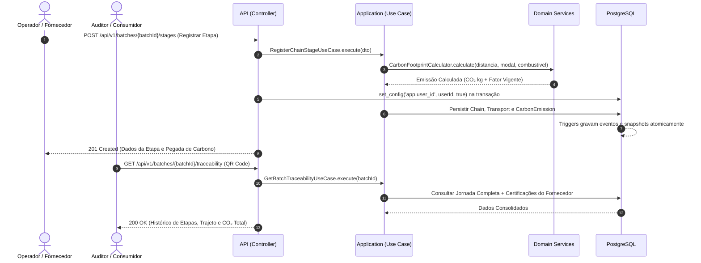

# 🌱 Supply Chain Verde — API de Rastreabilidade & Sustentabilidade


> Rastreabilidade de lotes, mensuração de emissões de CO₂ e auditoria contínua para cadeias de suprimento sustentáveis.

A **Supply Chain Verde API** é uma solução backend de alta confiabilidade desenvolvida em **Java 25** e **Spring Boot**, estruturada sob os pilares da **Clean Architecture** e **Domain-Driven Design (DDD)**. O sistema rastreia cada lote de produto (`Batch`) desde a sua origem primária até o varejo através de etapas logísticas e produtivas (`Chain`), calculando emissões de gases de efeito estufa por transporte/processamento, validando certificações ambientais e gerando relatórios auditáveis com ranking dinâmico de fornecedores.


```mermaid
sequenceDiagram
    autonumber
    actor User as Operador / Fornecedor
    actor Auditor as Auditor / Consumidor
    participant API as API (Controller)
    participant UC as Application (Use Case)
    participant Domain as Domain Services
    participant DB as PostgreSQL

    User->>API: POST /api/v1/batches/{batchId}/stages (Registrar Etapa)
    API->>UC: RegisterChainStageUseCase.execute(dto)
    UC->>Domain: CarbonFootprintCalculator.calculate(distancia, modal, combustivel)
    Domain-->>UC: Emissão Calculada (CO₂ kg + Fator Vigente)
    API->>DB: set_config('app.user_id', userId, true) na transação
    UC->>DB: Persistir Chain, Transport e CarbonEmission
    DB-->>DB: Triggers gravam eventos e snapshots atomicamente
    API-->>User: 201 Created (Dados da Etapa e Pegada de Carbono)

    Auditor->>API: GET /api/v1/batches/{batchId}/traceability (QR Code)
    API->>UC: GetBatchTraceabilityUseCase.execute(batchId)
    UC->>DB: Consultar Jornada Completa + Certificações do Fornecedor
    DB-->>UC: Dados Consolidados
    API-->>Auditor: 200 OK (Histórico de Etapas, Trajeto e CO₂ Total)
```

---

## ✨ O Problema
Cadeias de suprimento modernas enfrentam graves desafios de governança e sustentabilidade:
- **Baixa Rastreabilidade**: Origem fragmentada de insumos e matérias-primas sem histórico contínuo da jornada do produto.
- **Greenwashing & Falta de Auditoria**: Certificações ambientais dispersas em PDFs sem verificação automática de validade ou expiração.
- **Cálculos de Carbono Inconsistentes**: Falta de padronização nas métricas de emissão de CO₂ e inexistência de registro do fator de emissão no momento do transporte.
- **Opacidade para o Consumidor**: Dificuldade do consumidor final em auditar a procedência socioambiental do produto na gôndola.

---

## 🚀 A Solução
A API Supply Chain Verde centraliza e orquestra a cadeia de suprimentos sustentável:
- **Rastreamento Granular por Lote (`Batch`)**: Cada lote é acompanhado através de etapas encadeadas (`Chain`), registrando localizações geográficas, operadores responsáveis e tempos de ciclo.
- **Cálculo de Emissão Confiável**: Emissões calculadas por modais e combustíveis com fixação da metodologia e fator de emissão vigente para auditoria contábil retroativa imutável.
- **Validação de Certificações**: Monitoramento proativo de certificações ativas, vencidas ou suspensas de fornecedores.
- **Ranking Dinâmico de Sustentabilidade**: Cálculo de score sob demanda com base em certificações ativas e histórico de emissões, evitando dados derivados desatualizados no banco.
- **Auditoria Automática**: Triggers PostgreSQL registram alterações nas tabelas de negócio; a API fornece o ator autenticado no contexto local da transação e apenas consulta os eventos.

---

## 🎯 Diferenciais
- **Clean Architecture Pura**: Camada de domínio agnóstica a frameworks e bibliotecas externas.
- **Auditoria mantida pelo banco**: a aplicação não insere linhas de auditoria. Triggers armazenam a operação, entidade afetada e snapshots sanitizados em JSONB, excluindo colunas internas de busca textual; consulte [`docs/adr/0001-auditoria-no-postgresql.md`](docs/adr/0001-auditoria-no-postgresql.md) para o contrato e as garantias transacionais.
- **Imutabilidade Histórica de Emissões**: Mudanças em tabelas de referência de emissão não afetam registros históricos passados, garantindo conformidade com normas ESG.
- **Rastreabilidade Pública via QR Code**: Endpoint aberto e otimizado para consulta da árvore genealógica e pegada de carbono do lote.
- **Configuração Sem Arquivos `.env`**: Configuração centralizada em `application.properties` utilizando placeholders flexíveis (`${VAR:default}`), pronta para rodar localmente ou em contêineres sem necessidade de arquivos `.env`.

---

## 🛠️ Stack Tecnológica

| Camada | Tecnologia |
|---|---|
| **Linguagem** | Java 25 (LTS) |
| **Framework** | Spring Boot 4.0.8 (WebMVC, Data JPA, Security, Validation, Actuator) |
| **Banco de Dados** | PostgreSQL 17 |
| **Database Migrations** | Flyway (SQL versionado puro) |
| **Mapeamento Objeto-Objeto** | MapStruct 1.6.3 |
| **Segurança & Tokens** | Spring Security + JJWT 0.12.6 (HMAC-SHA256) |
| **Boilerplate Reduction** | Project Lombok |
| **Testes** | JUnit 5, Mockito, Testcontainers (PostgreSQL) |
| **Containerização** | Docker & Docker Compose |

---

## 🏛️ Arquitetura (Clean Architecture)

O projeto segue estritamente a **Regra da Dependência**: classes de camadas externas apontam para dentro; a camada de Domínio desconhece infraestrutura, banco de dados e frameworks.

```
domain          ← Regras de negócio puras, Entidades, Enums, Value Objects e Interfaces de Repositório
   ↑
application     ← Casos de Uso (orquestração), DTOs (records) e Mappers de Aplicação
   ↑
infrastructure  ← Spring Boot, Hibernate/JPA, Controllers REST, Migrations Flyway, Segurança JWT, AOP
```

### Status de Implementação

- **Fase 1 — Domain Layer concluída**: enums, value objects, entidades de domínio, interfaces de repositório, serviços de domínio e exceções estão implementados.
- **Fase 2 — Migrations concluída**: migrations Flyway versionadas para as 11 tabelas do modelo.
- **Fase 3 — Persistence Layer concluída**: entidades JPA, repositórios Spring Data, implementações dos repositórios de domínio e mappers JPA.
- **Fase 4 — Application Layer concluída**: DTOs imutáveis, mappers MapStruct, casos de uso e exceções da aplicação.
- **Fase 5 — Web Layer concluída**: controllers REST, tratamento global de exceções, CORS e documentação OpenAPI/Swagger.
- A camada `domain` permanece sem dependência de Spring/JPA; as integrações concretas ficam nas camadas externas.
- **Fase 6 — Security concluída**: autenticação JWT stateless, hash BCrypt, filtro de autenticação e autorização por perfil.
- **Auditoria — implementação atual**: captura por triggers PostgreSQL na migration V29; aplicação nos ambientes depende do rollout coordenado descrito na [ADR 0001](docs/adr/0001-auditoria-no-postgresql.md).
- **Fase 8 — Testes concluída**: testes unitários, testes de casos de uso e integração com Testcontainers.
- Validação local realizada com `./mvnw --batch-mode verify`.

### Principais Entidades de Domínio
- **`Supplier`**: Fornecedores cadastrados com CNPJ validado e sede em `Address`.
- **`Certification`**: Certificações ambientais vinculadas a fornecedores com ciclo de validade.
- **`Product` & `Batch`**: Produtos e seus lotes físicos identificáveis.
- **`Chain`**: Etapas da cadeia (produção, armazenagem, transporte, distribuição, varejo) com `User` responsável obrigatório.
- **`Transport` & `CarbonEmission`**: Dados de frete (modal, combustível, distância) e cálculo de CO₂ emitido.
- **`Report`**: Relatórios consolidados de sustentabilidade para órgãos reguladores e auditorias.
- **`AuditLog`**: Registros de auditoria gerados automaticamente para compliance.

---

## 📁 Estrutura do Projeto

```text
src/main/java/br/com/anhembi/supplychainverde/
│
├── domain/                      # Camada de Domínio (Zero dependências externas)
│   ├── entity/                  # Entidades de negócio ricas
│   ├── enums/                   # Enums tipados (StageType, TransportMode, etc.)
│   ├── valueobject/             # Records com validação compacta (Cnpj, EmissionFactor)
│   ├── repository/              # Interfaces puras de persistência
│   ├── service/                 # Serviços de domínio (Calculators, Hasher interface)
│   └── exception/               # Exceções de domínio
│
├── application/                 # Camada de Aplicação (Casos de Uso)
│   ├── usecase/                 # Classes UseCase com método execute()
│   ├── dto/                     # Records imutáveis de Request e Response
│   ├── mapper/                  # Mappers MapStruct (DTO ↔ Domínio)
│   └── exception/               # Exceções da aplicação
│
├── infrastructure/              # Camada de Infraestrutura (Frameworks & Drivers)
│   ├── web/                     # Controllers REST, ExceptionHandler e Configs Web
│   ├── persistence/             # JPA Entities, Repositories Spring Data e Mappers JPA
│   ├── security/                # JWT Provider, Filtro, BCrypt e SecurityConfig
│   ├── audit/                   # Consulta da auditoria; captura fica nas triggers PostgreSQL
│   └── config/                  # Beans de configuração da aplicação
│
└── SupplyChainVerdeApplication.java
```

## 📚 Documentação do Projeto

| Documento | Conteúdo |
|---|---|
| [`docs/spec.md`](docs/spec.md) | Requisitos funcionais, perfis, regras de negócio e fluxos |
| [`docs/plan.md`](docs/plan.md) | Arquitetura técnica, stack, persistência, segurança e testes |
| [`docs/reference.md`](docs/reference.md) | Entidades, casos de uso, endpoints, DTOs e configuração |
| [`docs/tasks.md`](docs/tasks.md) | Checklist de implementação e evolução |
| [`.github/copilot-instructions.md`](.github/copilot-instructions.md) | Instruções gerais para o GitHub Copilot |

### Pipeline de Qualidade

Os Pull Requests executam automaticamente:

- build e testes Maven;
- geração de cobertura JaCoCo, publicada como artifact;
- revisão de dependências pelo Dependency Review;
- análise estática de segurança com CodeQL.

O CodeQL usa Java 25 explicitamente e não exige token externo. O Dependency Review depende do Dependency Graph habilitado nas configurações de segurança do repositório.

---

## ⚡ Quick Start (com Docker Compose)

### Pré-requisitos
- [Docker & Docker Compose](https://www.docker.com/) instalado
- [JDK 25](https://jdk.java.net/25/) instalado (ou utilize o wrapper Maven incluso)

### 1. Clonar o repositório
```bash
git clone https://github.com/matheusnascimentods/supply-chain-verde-api.git
cd supply-chain-verde-api
```

### 2. Subir o Banco de Dados PostgreSQL
O projeto disponibiliza um `docker-compose.yml` pré-configurado:
```bash
docker compose up -d
```
Isso iniciará o PostgreSQL na porta `5432` com o banco `supply_chain_verde`.

### 3. Executar a Aplicação
```bash
./mvnw spring-boot:run
```

A API estará disponível em: **`http://localhost:8080`**

A documentação interativa OpenAPI/Swagger fica disponível em:

- **`http://localhost:8080/swagger-ui.html`**
- **`http://localhost:8080/v3/api-docs`**

### Usuários Seed

As migrations de seed criam usuários para desenvolvimento e demonstração. A senha de todos os usuários seed é:

```text
rolocompressor06
```

Essa credencial é exclusiva para o ambiente local/demonstrativo e deve ser substituída antes de qualquer uso em ambiente compartilhado ou de produção.

O seed ampliado de demonstração é carregado pelas migrations padrão em `src/main/resources/db/migration`.

---

## 💻 Comandos Úteis de Desenvolvimento

```bash
# Compilar o projeto e processar anotações (Lombok + MapStruct)
./mvnw clean compile

# Rodar todos os testes unitários e de integração (com Testcontainers)
./mvnw test

# Empacotar artefato JAR final
./mvnw clean package

# Parar o banco de dados Docker
docker compose down

# Parar o banco de dados Docker removendo volumes de dados
docker compose down -v
```

---

## 🔌 API Reference (Principais Recursos)

### 📊 Dashboard (`/api/v1/dashboard`)
| Método | Rota | Descrição | Acesso |
| :--- | :--- | :--- | :--- |
| `GET` | `/api/v1/dashboard/summary?limit=10` | Indicadores globais e lotes recentes (`limit` padrão 10, máximo 100) | Qualquer usuário autenticado |

O resumo é global para todos os perfis autenticados. `activeBatches` exclui lotes sem etapas e lotes cuja etapa mais recente seja `RETAIL`; a etapa mais recente é determinada por `startedAt`, com `chainId` como desempate. A lista `recentBatches` é ordenada por data de produção decrescente e inclui o status da etapa mais recente; lotes sem etapas não podem ser listados, mas lotes em `RETAIL` podem aparecer como recentes. `expiringCertifications` considera vencimentos de hoje até os próximos 30 dias, inclusive. `suppliers` conta todos os fornecedores cadastrados. `monthlyEmissionKgCo2e` soma `co2Kg` calculado no mês calendário atual conforme `calculatedAt`.

### 🔐 Autenticação (`/api/v1/auth`)
| Método | Rota | Descrição | Acesso |
| :--- | :--- | :--- | :--- |
| `POST` | `/api/v1/auth/login` | Autenticação e emissão do token JWT | Público |

### 🏢 Fornecedores (`/api/v1/suppliers`)
| Método | Rota | Descrição | Acesso |
| :--- | :--- | :--- | :--- |
| `POST` | `/api/v1/suppliers` | Cadastro de novo fornecedor | `ADMIN`, `MANAGER` |
| `GET` | `/api/v1/suppliers` | Listagem de fornecedores cadastrados | Autenticado |
| `GET` | `/api/v1/suppliers/ranking?limit=20&offset=0&search={termo}` | Ranking paginado; busca por nome (full-text em português) ou trecho do CNPJ normalizado | Autenticado |
| `GET` | `/api/v1/suppliers/{supplierId}` | Detalhes do fornecedor | Autenticado |
| `PUT` | `/api/v1/suppliers/{supplierId}` | Atualização de dados cadastrais | `ADMIN`, `MANAGER` |

### 🛒 Produtos (`/api/v1/products`)
| Método | Rota | Descrição | Acesso |
| :--- | :--- | :--- | :--- |
| `POST` | `/api/v1/products` | Cadastro de produto | `ADMIN`, `MANAGER` |
| `PUT` | `/api/v1/products/{productId}` | Atualização de produto | `ADMIN`, `MANAGER` |
| `GET` | `/api/v1/products?limit=20&offset=0&search={termo}` | Listagem paginada; busca full-text por nome/descrição ou por código/rótulo de categoria | Autenticado |

### 📜 Certificações (`/api/v1/certifications`)
| Método | Rota | Descrição | Acesso |
| :--- | :--- | :--- | :--- |
| `POST` | `/api/v1/suppliers/{supplierId}/certifications` | Registro de certificação ambiental | `SUPPLIER`, `ADMIN` |
| `PATCH` | `/api/v1/certifications/{certificationId}/status` | Atualização do status da certificação | `AUDITOR`, `ADMIN` |
| `GET` | `/api/v1/certifications?page=0&size=20&status=ACTIVE` | Listagem paginada; `status` opcional aceita `ACTIVE`, `EXPIRED`, `SUSPENDED` ou `UNDER_REVIEW`; sem filtro retorna todos os status ordenados por emissão mais recente (`page` zero-based; `size` padrão 20, máximo 100) | `AUDITOR`, `MANAGER`, `ADMIN` |

### 🧾 Auditoria (`/api/v1/audit-logs`)
| Método | Rota | Descrição | Acesso |
| :--- | :--- | :--- | :--- |
| `GET` | `/api/v1/audit-logs?from=2026-09-01&to=2026-09-30&action=UPDATE&userEmail=ana&limit=20&offset=0` | Lista logs do período inclusivo, com filtros opcionais e paginação | `ADMIN`, `AUDITOR` |

O período `from`/`to` é obrigatório e usa `YYYY-MM-DD`; `action` aceita `INSERT`, `UPDATE`, `DELETE` ou `STATUS_CHANGE`. `userEmail` faz busca parcial sem diferenciar caixa. `limit` aceita de 1 a 100 (padrão 20) e `offset` começa em 0.

Cada item retornado inclui `logId`, `userId`, `userEmail`, `action`, `affectedTable`, `affectedEntityId`, `beforeData`, `afterData` e `performedAt`. `beforeData`/`afterData` são snapshots JSONB com apenas valores alterados e associações como IDs; podem ser `null` quando a operação não tem aquele lado (INSERT/DELETE). Segredos não podem ser incluídos nos snapshots.

A captura é responsabilidade do PostgreSQL, não de um interceptor Java. Triggers escrevem eventos na mesma transação que altera a linha. Antes da primeira escrita, a API propaga o `userId` autenticado com `set_config('app.user_id', :userId, true)` na mesma conexão/transação; as triggers leem `current_setting('app.user_id', true)`. Isso é contexto transacional, não cache de sessão. A role da API consulta logs, mas não os insere diretamente. A migration V29 substitui o histórico e inicia a nova tabela vazia; nenhum evento anterior será inferido ou copiado. O executor Flyway precisa criar a role de owner das triggers e o principal runtime precisa corresponder à role que recebe SELECT. Veja [`docs/adr/0001-auditoria-no-postgresql.md`](docs/adr/0001-auditoria-no-postgresql.md).

### 📦 Lotes & Rastreabilidade (`/api/v1/batches`)
| Método | Rota | Descrição | Acesso |
| :--- | :--- | :--- | :--- |
| `POST` | `/api/v1/batches` | Criação de novo lote de produto | `SUPPLIER`, `ADMIN` |
| `GET` | `/api/v1/batches?page=0&size=20&supplierId=4` | Listagem paginada (`page` zero-based; `size` padrão 20, máximo 100); cada item inclui etapa atual e timeline com endereços, transporte e emissão; `supplierId` filtra a lista para perfis administrativos | `ADMIN`, `MANAGER`, `AUDITOR`, `SUPPLIER` |
| `GET` | `/api/v1/batches/{batchId}/traceability` | Jornada completa do lote (QR Code) | **Público** |

Como o modelo atual ainda não possui associação explícita entre usuário e fornecedor, para `SUPPLIER` o backend adota a convenção de que `userId` do token é igual a `supplierId`. O servidor ignora `supplierId` da query para esse perfil e consulta apenas os lotes desse identificador.

Cada item da página preserva `batchId`, `productId`, `productName`, `supplierId`, `supplierName`, `quantity` e `producedAt`, e também inclui `currentStage` (`StageType` da etapa mais recente ou `null`) e `stages` (array cronológico, vazio quando não há etapas). Cada etapa segue o contrato de `ChainResponseDTO`, com `originAddress`, `destinationAddress`, `transport` e `emission` anuláveis. A ordenação cronológica usa `startedAt` crescente e `chainId` crescente; para determinar `currentStage`, a etapa mais recente é a última nessa ordenação. O enriquecimento busca os dados relacionados em lote após a paginação, sem uma consulta por lote.

Exemplo de item sem etapas: `{"batchId": 100, "productId": 9, "productName": "Arroz Integral", "supplierId": 5, "supplierName": "Cooperativa do Vale", "quantity": 250.0, "producedAt": "2026-09-18", "currentStage": null, "stages": []}`. A resposta de exemplo com etapas, transporte e emissão está detalhada na Task 25 em `docs/tasks.md`.

### 🔗 Etapas da Cadeia (`/api/v1/batches/{batchId}/stages`)
| Método | Rota | Descrição | Acesso |
| :--- | :--- | :--- | :--- |
| `POST` | `/api/v1/batches/{batchId}/stages` | Registro de nova etapa na cadeia | `SUPPLIER`, `MANAGER`, `ADMIN` |
| `GET` | `/api/v1/batches/{batchId}/stages` | Etapas percorridas pelo lote em ordem | Autenticado |
| `POST` | `/api/v1/stages/{chainId}/transport` | Registro do transporte da etapa | `SUPPLIER`, `MANAGER`, `ADMIN` |

### 🌿 Emissões de Carbono
| Método | Rota | Descrição | Acesso |
| :--- | :--- | :--- | :--- |
| `POST` | `/api/v1/stages/{chainId}/emission` | Cálculo e persistência de emissão de CO₂ | `MANAGER`, `ADMIN` |
| `GET` | `/api/v1/batches/{batchId}/carbon-footprint` | Pegada de carbono consolidada do lote | **Público** |

### 📊 Relatórios ESG (`/api/v1/reports`)
| Método | Rota | Descrição | Acesso |
| :--- | :--- | :--- | :--- |
| `POST` | `/api/v1/suppliers/{supplierId}/reports` | Geração de relatório consolidado | `AUDITOR`, `MANAGER`, `ADMIN` |
| `GET` | `/api/v1/reports/{reportId}` | Consulta de relatório | `AUDITOR`, `MANAGER`, `ADMIN`, `SUPPLIER` |
| `GET` | `/api/v1/suppliers/{supplierId}/reports` | Lista relatórios do fornecedor | Conforme proprietário/perfil |

---

## 🗂️ Variáveis de Ambiente & Configuração

O projeto dispensa arquivos `.env` versionados. As configurações são centralizadas em [`application.properties`](src/main/resources/application.properties) e podem ser customizadas via variáveis de ambiente:

| Variável de Ambiente | Descrição | Valor Default (Local) |
| :--- | :--- | :--- |
| `SERVER_PORT` | Porta de execução da API | `8080` |
| `SPRING_DATASOURCE_URL` | URL JDBC do PostgreSQL | `jdbc:postgresql://localhost:5432/supply_chain_verde` |
| `SPRING_DATASOURCE_USERNAME` | Usuário do banco de dados | `postgres` |
| `SPRING_DATASOURCE_PASSWORD` | Senha do banco de dados | Configurar localmente; nunca usar default em ambientes compartilhados |
| `FLYWAY_ENABLED` | Execução automática de migrations Flyway | `true` |
| `JWT_SECRET` | Chave HMAC de 256 bits para assinatura do token | Configurar localmente; obrigatório e forte em ambientes compartilhados |
| `JWT_EXPIRATION_MS` | Tempo de expiração do token em milissegundos | `3600000` (1 hora) |
| `CORS_ALLOWED_ORIGINS` | Origem permitida para o frontend cliente | `http://localhost:4200` |

---

Em desenvolvimento local, defina `SPRING_DATASOURCE_PASSWORD` e `JWT_SECRET` no ambiente da execução quando necessário. Em ambientes compartilhados ou de produção, esses valores devem ser obrigatoriamente fornecidos por secrets da plataforma e nunca devem ser credenciais previsíveis ou versionadas.

## 🔒 Segurança & Boas Práticas

- **Autenticação Stateless**: Tokens JWT assinados com HMAC-SHA256, transportando `userId`, `email` e `role`.
- **Controle de Acesso Baseado em Perfis (RBAC)**: Validação estrita por papéis (`ADMIN`, `AUDITOR`, `SUPPLIER`, `MANAGER`).
- **Criptografia Segura de Senhas**: Hashes gerados via `BCryptPasswordEncoder` através da abstração `PasswordHasher`.
- **Proteção de Integridade & Auditoria**: Triggers PostgreSQL registram usuário, ação, tabela/entidade e snapshots. A aplicação define `app.user_id` na transação e não escreve diretamente em `audit_log`.
- **Clean Architecture & DDD**: Desacoplamento completo entre modelo relacional de banco e entidades de negócio.

---

## 🤝 Contribuindo

1. Faça um Fork do projeto
2. Crie uma branch para a sua funcionalidade (`git checkout -b feature/nome-da-feature`)
3. Faça o commit das suas alterações (`git commit -m 'feat: implementa nova funcionalidade'`)
4. Envie para o repositório remoto (`git push origin feature/nome-da-feature`)
5. Abra um **Pull Request** detalhando as alterações

---

## 📄 Licença

Distribuído sob a licença MIT. Veja [`LICENSE.txt`](LICENSE.txt) para mais detalhes.

---
Feito com ❤️ por [@matheusnascimentods](https://github.com/matheusnascimentods)
