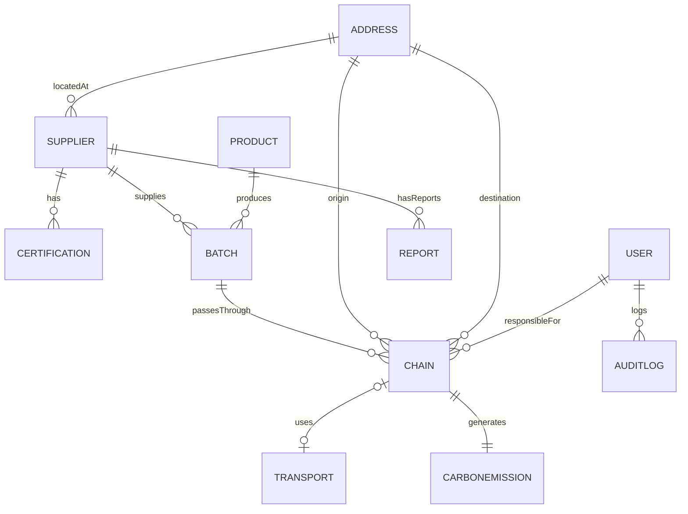

# reference.md — Referência do domínio e da API

> Catálogo técnico complementar ao `spec.md` e ao `plan.md`. Este arquivo concentra detalhes que o agente precisa consultar, mas que não devem ficar nas instruções operacionais do Copilot.

## 1. Entidades

| Entidade | Relações e responsabilidade |
|---|---|
| `Address` | Endereço reutilizado por fornecedor e etapas |
| `User` | Usuário, email, hash de senha, perfil e criação |
| `Supplier` | Fornecedor com CNPJ, endereço e telefone |
| `Certification` | Certificação ambiental, emissor, validade e status |
| `Product` | Produto com categoria, unidade e descrição |
| `Batch` | Lote de produto fornecido por um supplier |
| `Chain` | Etapa do lote, responsável, origem/destino e período |
| `Transport` | Modal, distância, combustível e capacidade da etapa |
| `CarbonEmission` | CO₂ calculado, fator, metodologia e data |
| `Report` | Consolidação por supplier e período |
| `AuditLog` | Ação, usuário, tabela afetada e timestamp |

As entidades de domínio referenciam objetos relacionados. A infraestrutura resolve essas relações ao reconstruir o domínio a partir das entidades JPA.

## 2. Enums

O domínio possui `CertificationStatus`, `ProductCategory`, `ProductUnit`, `StageType`, `TransportMode`, `FuelType`, `CalculationMethod`, `UserRole` e `AuditAction`. Eles representam conjuntos fechados e não devem ser modelados como strings livres.

## 3. Casos de uso

```text
supplier: Register, Update, Get, List, RankBySustainability
certification: Register, UpdateStatus, ListExpiring
product: Register, Update, List
batch: Register, GetTraceability, ListBySupplier
chain: RegisterStage, ListStagesByBatch
transport: Register
emission: Calculate, GetBatchCarbonFootprint
report: Generate, Get, ListBySupplier
user: Register, Authenticate, UpdateRole
audit: ListAuditLogs
```

## 4. Rotas

Base path: `/api/v1`.

| Recurso | Rotas principais | Acesso |
|---|---|---|
| Auth | `POST /auth/login` | Público |
| Users | `POST /users`, `GET /users/me`, `PATCH /users/{userId}/role` | Admin ou autenticado |
| Suppliers | `POST`, `PUT`, `GET /suppliers`, `GET /suppliers/{supplierId}`, `GET /suppliers/ranking` | Conforme RBAC |
| Certifications | `POST /suppliers/{supplierId}/certifications`, `PATCH /certifications/{certificationId}/status`, `GET /certifications/expiring` | Conforme RBAC |
| Products | `POST /products`, `PUT /products/{productId}`, `GET /products` | Conforme RBAC |
| Batches | `POST /batches`, `GET /batches/{batchId}/traceability`, `GET /suppliers/{supplierId}/batches` | Consulta pública de rastreabilidade |
| Chains | `POST /batches/{batchId}/stages`, `GET /batches/{batchId}/stages` | Conforme RBAC |
| Transport | `POST /stages/{chainId}/transport` | Conforme RBAC |
| Emissions | `POST /stages/{chainId}/emission`, `GET /batches/{batchId}/carbon-footprint` | Consulta pública de pegada |
| Reports | `POST /suppliers/{supplierId}/reports`, `GET /reports/{reportId}`, `GET /suppliers/{supplierId}/reports` | Conforme RBAC |
| Audit | `GET /audit-logs` | Admin e auditor |

## 5. DTOs e regras de entrada

- Auth: `LoginRequestDTO`, `LoginResponseDTO`.
- Users: `UserRequestDTO`, `UserResponseDTO`, `UpdateUserRoleRequestDTO`.
- Address: `AddressRequestDTO`, `AddressResponseDTO`.
- Supplier: `SupplierRequestDTO`, `SupplierResponseDTO`, `SupplierRankingDTO`.
- Certification: `CertificationRequestDTO`, `CertificationResponseDTO`, `UpdateCertificationStatusRequestDTO`.
- Product: `ProductRequestDTO`, `ProductResponseDTO`.
- Batch: `BatchRequestDTO`, `BatchResponseDTO`, `BatchTraceabilityResponseDTO`.
- Chain: `ChainRequestDTO`, `ChainResponseDTO`.
- Transport: `TransportRequestDTO`, `TransportResponseDTO`.
- Emission: `CarbonEmissionRequestDTO`, `CarbonEmissionResponseDTO`, `CarbonFootprintResponseDTO`.
- Report: `ReportRequestDTO`, `ReportResponseDTO`.
- Audit: `AuditLogResponseDTO`.

`responsibleUserId` e `userId` de auditoria vêm do contexto autenticado, nunca do corpo da requisição. `emissionFactor` e `co2Kg` são calculados pelo backend, nunca aceitos do cliente.

## 6. Segurança

- JWT stateless com claims `userId`, `email` e `role`.
- Senhas armazenadas somente como hash BCrypt.
- `JWT_SECRET` deve ser fornecido externamente e ter pelo menos 256 bits.
- Rotas públicas: login, rastreabilidade e pegada de carbono.
- Risco conhecido: `batchId` sequencial exposto publicamente pode permitir enumeração; avaliar rate limiting ou UUID público.

## 7. Variáveis de ambiente

| Variável | Finalidade |
|---|---|
| `SPRING_PROFILES_ACTIVE` | Perfil ativo |
| `SERVER_PORT` | Porta HTTP |
| `SPRING_DATASOURCE_URL` | URL JDBC |
| `SPRING_DATASOURCE_USERNAME` | Usuário PostgreSQL |
| `SPRING_DATASOURCE_PASSWORD` | Senha PostgreSQL |
| `JWT_SECRET` | Chave de assinatura JWT |
| `JWT_EXPIRATION_MS` | Expiração do token |
| `CORS_ALLOWED_ORIGINS` | Origens permitidas |
| `FLYWAY_ENABLED` | Ativação do Flyway |

Segredos não devem ter valores reais, previsíveis ou versionados.

## 8. Modelo de dados



