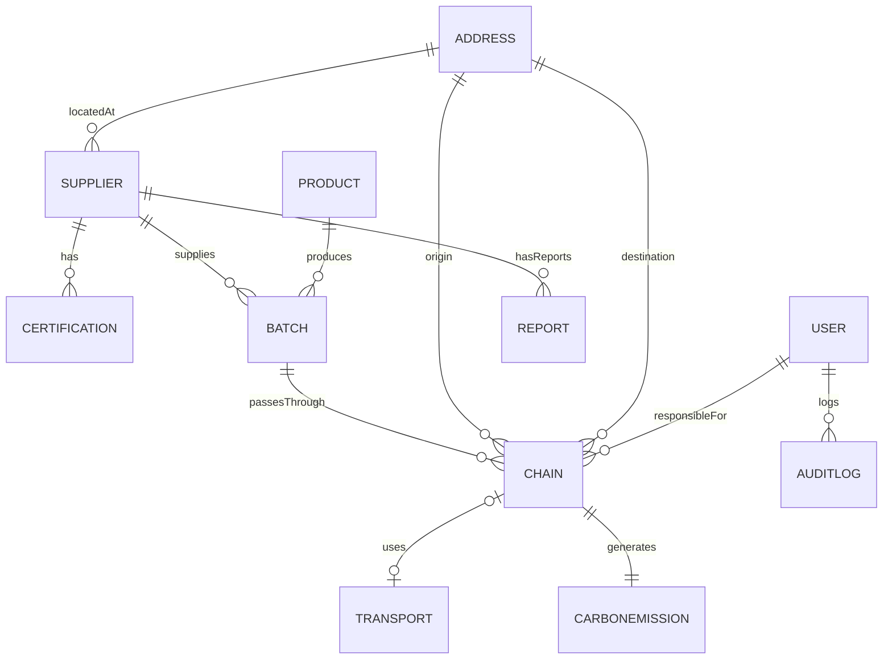

# reference.md — Referência do domínio e da API

> Catálogo técnico complementar ao `spec.md` e ao `plan.md`. Este arquivo concentra detalhes que o agente precisa consultar, mas que não devem ficar nas instruções operacionais do Copilot.

## 1. Entidades

| Entidade | Relações e responsabilidade |
|---|---|
| `Address` | Endereço reutilizado por fornecedor e etapas |
| `User` | Usuário, email, hash de senha, perfil e criação |
| `Supplier` | Fornecedor com CNPJ, endereço e telefone |
| `Certification` | Certificação ambiental, emissor, validade e status |
| `Product` | Produto com categoria, unidade e descrição |
| `Batch` | Lote de produto fornecido por um supplier |
| `Chain` | Etapa do lote, responsável, origem/destino e período |
| `Transport` | Modal, distância, combustível e capacidade da etapa |
| `CarbonEmission` | CO₂ calculado, fator, metodologia e data |
| `Report` | Consolidação por supplier e período |
| `AuditLog` | Evento criado por trigger PostgreSQL, com ator, operação, tabela/ID afetado, snapshots JSONB e timestamp; somente leitura pela API |

As entidades de domínio referenciam objetos relacionados. A infraestrutura resolve essas relações ao reconstruir o domínio a partir das entidades JPA.

## 2. Enums

O domínio possui `CertificationStatus`, `ProductCategory`, `ProductUnit`, `StageType`, `TransportMode`, `FuelType`, `CalculationMethod`, `UserRole` e `AuditAction`. Eles representam conjuntos fechados e não devem ser modelados como strings livres.

## 3. Casos de uso

```text
supplier: Register, Update, Get, List, RankBySustainability
certification: Register, UpdateStatus, ListPage with optional status filter
product: Register, Update, List
batch: Register, GetTraceability, ListBySupplier
chain: RegisterStage, ListStagesByBatch
transport: Register
emission: Calculate, GetBatchCarbonFootprint
report: Generate, Get, ListBySupplier
user: Register, Authenticate, UpdateRole
audit: ListAuditLogs
dashboard: GetSummary
```

## 4. Rotas

Base path: `/api/v1`.

| Recurso | Rotas principais | Acesso |
|---|---|---|
| Auth | `POST /auth/login` | Público |
| Users | `POST /users`, `GET /users?email={fragment}&limit=20&offset=0` (resposta paginada com `items`, `limit`, `offset`, `hasNext`, `totalPages`), `GET /users/me`, `PATCH /users/{userId}/role` | Listagem: `ADMIN`; `/me`: autenticado; demais conforme RBAC |
| Suppliers | `POST`, `PUT`, `GET /suppliers`, `GET /suppliers?supplierId={id}`, `GET /suppliers?ranked=true&limit=20&offset=0&search={termo}` (resposta paginada com `items`, `limit`, `offset`, `hasNext`, `totalPages`; busca por nome/CNPJ). Tanto a lista quanto cada item ranqueado expõem dados cadastrais e métricas de sustentabilidade | Conforme RBAC |
| Certifications | `GET /certifications?page=0&size=20&status=ACTIVE` (paginada; filtro de status opcional, padrão 20, máximo 100), `POST /suppliers/{supplierId}/certifications`, `PATCH /certifications/{certificationId}/status` | Consulta: `AUDITOR`, `MANAGER`, `ADMIN` |
| Products | `POST /products`, `PUT /products/{productId}`, `GET /products?limit=20&offset=0&search={termo}` (resposta paginada com `items`, `limit`, `offset`, `hasNext`, `totalPages`; busca por nome, descrição ou categoria) | Conforme RBAC |
| Batches | `POST /batches`, `GET /batches?page=0&size=20&supplierId={id}` (paginada; padrão 20, máximo 100), `GET /batches/{batchId}/traceability` | Listagem geral para `admin`, `manager` e `auditor`; `supplier` usa `userId` do token como `supplierId`; rastreabilidade pública |
| Chains | `POST /batches/{batchId}/stages`, `GET /batches/{batchId}/stages` | Conforme RBAC |
| Transport | `POST /stages/{chainId}/transport` | Conforme RBAC |
| Emissions | `POST /stages/{chainId}/emission`, `GET /batches/{batchId}/carbon-footprint` | Consulta pública de pegada |
| Reports | `POST /suppliers/{supplierId}/reports`, `GET /reports?limit=20&offset=0&supplierId={id}` (resposta paginada com `items`, `limit`, `offset`, `hasNext`, `totalPages`), `GET /reports?reportId={id}` (detalhe) | Listagem global: `ADMIN`, `MANAGER`, `AUDITOR`; `SUPPLIER` somente os próprios |
| Audit | Triggers PostgreSQL criam eventos; `GET /audit-logs?from=2026-09-01&to=2026-09-30&action=UPDATE&userEmail=ana&limit=20&offset=0` consulta a resposta paginada com `items`, `limit`, `offset`, `hasNext`, `totalPages`; período obrigatório, ação/email opcionais | Admin e auditor |
| Dashboard | `GET /dashboard/summary?limit=10` | Qualquer usuário autenticado; dados globais |

### Evento de auditoria

```json
{
  "logId": 981,
  "userId": 7,
  "userEmail": "ana.souza@empresa.com",
  "action": "UPDATE",
  "affectedTable": "supplier",
  "affectedEntityId": 42,
  "beforeData": { "name": "Fazenda Verde" },
  "afterData": { "name": "Fazenda Verde Ltda" },
  "performedAt": "2026-09-30T14:32:10"
}
```

Para `INSERT`, `beforeData` é `null`; para `DELETE`, `afterData` é `null`. Nos updates, os dois objetos contêm somente valores de colunas que mudaram. FKs são armazenadas como IDs; a trigger omite colunas sensíveis conhecidas e colunas técnicas derivadas para busca, como `search_vector` e `name_search`. `STATUS_CHANGE` é usado somente quando um dos campos de estado configurados para a entidade realmente mudou. Veja a [ADR de auditoria no PostgreSQL](adr/0001-auditoria-no-postgresql.md) para propagação do ator e detalhe da persistência.

## 5. DTOs e regras de entrada

- Auth: `LoginRequestDTO`, `LoginResponseDTO`.
- Users: `UserRequestDTO`, `UserResponseDTO`, `UpdateUserRoleRequestDTO`.
- Address: `AddressRequestDTO`, `AddressResponseDTO`.
- Supplier: `SupplierRequestDTO`, `SupplierResponseDTO`, `SupplierRankingDTO`.
- Certification: `CertificationRequestDTO`, `CertificationResponseDTO`, `UpdateCertificationStatusRequestDTO`.
- Product: `ProductRequestDTO`, `ProductResponseDTO`.
- Batch: `BatchRequestDTO`, `BatchResponseDTO`, `BatchTraceabilityResponseDTO`.
- Chain: `ChainRequestDTO`, `ChainResponseDTO`.
- Transport: `TransportRequestDTO`, `TransportResponseDTO`.
- Emission: `CarbonEmissionRequestDTO`, `CarbonEmissionResponseDTO`, `CarbonFootprintResponseDTO`.
- Paginação por deslocamento: as rotas de usuários, ranking de fornecedores (`GET /suppliers?ranked=true`), produtos, relatórios e auditoria retornam `OffsetPageResponseDTO<T>`, com `items`, `limit`, `offset`, `hasNext` e `totalPages`. A fábrica do DTO deriva `hasNext` e `totalPages` da contagem filtrada total e dos parâmetros recebidos.
- Users: `UserResponseDTO` representa cada usuário; a busca `email` parcial case-insensitive usa o índice GIN trigram `lower(email)`. Limite padrão 20, máximo 100; offset padrão 0.
- Report: `ReportRequestDTO`, `ReportResponseDTO`, `ReportListItemDTO` e `ReportDetailDTO`. A listagem retorna CNPJ e nome do fornecedor, total de lotes produzidos entre as datas do relatório e CO₂ total; o total considera o filtro de fornecedor e a autorização aplicada. O detalhe também mantém `trackedProductCount`. Limite padrão 20, máximo 100; offset padrão 0.
- Audit: `AuditLogResponseDTO` representa eventos persistidos pelas triggers, incluindo `affectedEntityId`, `beforeData` e `afterData`; a contagem considera intervalo, ação e email do usuário. A API não persiste eventos de auditoria.

As demais respostas offset-paginadas de produtos e ranking de fornecedores também contêm `items`, `limit`, `offset`, `hasNext` e `totalPages`. O total de páginas é calculado sobre todos os resultados após a aplicação dos filtros e é `0` quando a consulta não retorna registros.
- Dashboard: `DashboardSummaryResponseDTO`, `RecentBatchSummaryDTO`.

Dashboard aceita `limit` entre `1` e `100` para a lista de lotes recentes; omitido ou nulo usa `10`. A contagem de lotes ativos exige ao menos uma etapa e exclui os lotes cuja etapa mais recente seja `RETAIL`. A última etapa é definida por `startedAt` e, em caso de empate, pelo maior `chainId`. Lotes sem etapas também não aparecem na lista recente, pois não possuem `status`; lotes em `RETAIL` podem aparecer como recentes. As certificações consideradas vencem de hoje até os próximos 30 dias, inclusive. `suppliers` conta todos os fornecedores cadastrados. A emissão mensal soma `co2Kg` por `calculatedAt` dentro do mês calendário corrente e retorna zero quando não há registros.

Na listagem e consulta individual de relatórios, `SUPPLIER` tem o `supplierId` limitado ao `userId` do token; filtros de fornecedor enviados por esse perfil são ignorados. A consulta individual usa `GET /reports?reportId={id}` e valida a propriedade do relatório. A antiga rota aninhada `GET /suppliers/{supplierId}/reports` foi removida; use `GET /reports?supplierId={id}`.

As consultas de fornecedores usam `GET /suppliers`: sem parâmetros retorna a lista; `supplierId` retorna o detalhe; `ranked=true` retorna o ranking paginado e aceita `limit`, `offset` e `search`. A lista e os itens do ranking usam a mesma estrutura com `supplierId`, `name`, `cnpj`, `address`, `phone`, `registeredAt`, `sustainabilityScore`, `activeCertificationCount` e `totalCo2Kg`. `supplierId` e `ranked` não podem ser enviados juntos, mesmo com `ranked=false`.

`responsibleUserId` e `userId` de auditoria vêm do contexto autenticado, nunca do corpo da requisição. Para cada transação de escrita, a API define `app.user_id` localmente na conexão/transação PostgreSQL antes da primeira mutação; a trigger usa o valor para atribuir o ator. `emissionFactor` e `co2Kg` são calculados pelo backend, nunca aceitos do cliente.

## 6. Segurança

- JWT stateless com claims `userId`, `email` e `role`.
- Senhas armazenadas somente como hash BCrypt.
- `JWT_SECRET` deve ser fornecido externamente e ter pelo menos 256 bits.
- Rotas públicas: login, rastreabilidade e pegada de carbono.
- Risco conhecido: `batchId` sequencial exposto publicamente pode permitir enumeração; avaliar rate limiting ou UUID público.

## 7. Variáveis de ambiente

| Variável | Finalidade |
|---|---|
| `SPRING_PROFILES_ACTIVE` | Perfil ativo |
| `SERVER_PORT` | Porta HTTP |
| `SPRING_DATASOURCE_URL` | URL JDBC |
| `SPRING_DATASOURCE_USERNAME` | Usuário PostgreSQL |
| `SPRING_DATASOURCE_PASSWORD` | Senha PostgreSQL |
| `JWT_SECRET` | Chave de assinatura JWT |
| `JWT_EXPIRATION_MS` | Expiração do token |
| `CORS_ALLOWED_ORIGINS` | Origens permitidas |
| `FLYWAY_ENABLED` | Ativação do Flyway |

Segredos não devem ter valores reais, previsíveis ou versionados.

## 8. Modelo de dados


```mermaid
erDiagram
  SUPPLIER ||--o{ CERTIFICATION : has
  SUPPLIER ||--o{ BATCH : supplies
  ADDRESS ||--o{ SUPPLIER : locatedAt
  PRODUCT ||--o{ BATCH : produces
  BATCH ||--o{ CHAIN : passesThrough
  ADDRESS ||--o{ CHAIN : origin
  ADDRESS ||--o{ CHAIN : destination
  USER ||--o{ CHAIN : responsibleFor
  CHAIN |o--o| TRANSPORT : uses
  CHAIN ||--|| CARBONEMISSION : generates
  SUPPLIER ||--o{ REPORT : hasReports
  USER ||--o{ AUDITLOG : logs
```


## Paginação das listagens

As listagens gerais de lotes e certificações aceitam `page` (índice iniciado em 0) e `size` (padrão 20, máximo 100). A API limita a quantidade retornada por chamada para evitar respostas excessivamente grandes.
