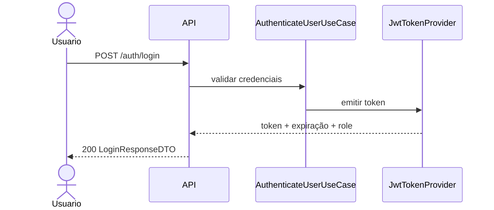
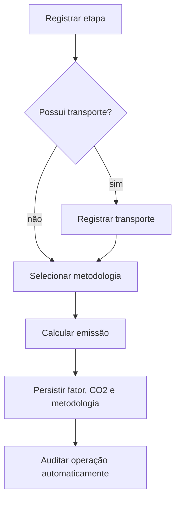

# spec.md — Supply Chain Verde API

> Especificação funcional: o que a API oferece e por quê, sem detalhar a implementação técnica. A arquitetura técnica fica no `plan.md` e o acompanhamento de execução no `tasks.md`.

## 1. Contexto

A Supply Chain Verde API oferece rastreabilidade de lotes, mensuração de emissões de CO₂ e governança ambiental para cadeias de suprimento sustentáveis. O sistema registra fornecedores, produtos, lotes e as etapas percorridas até o varejo, mantendo certificações e uma trilha de auditoria.

O backend serve o frontend web e também disponibiliza consultas públicas para consumidores que acessam a jornada de um lote por QR Code.

## 2. Perfis de usuário

| Perfil | Quem é | Acesso |
|---|---|---|
| Público | Consumidor ou auditor externo consultando um QR Code | Rastreabilidade e pegada de carbono públicas |
| `admin` | Administrador do sistema | Gestão completa |
| `manager` | Gestor da cadeia | Fornecedores, produtos, etapas e relatórios |
| `auditor` | Auditor ambiental ou de conformidade | Certificações, relatórios e auditoria |
| `supplier` | Fornecedor participante da cadeia | Próprios dados, certificações, lotes e etapas permitidas |

## 3. Capacidades funcionais

### 3.1 Autenticação e autorização

- Usuários entram com email e senha.
- A API valida a senha usando hash BCrypt e devolve um JWT com `userId`, `email` e `role`.
- Recursos protegidos exigem `Authorization: Bearer <token>`.
- A autorização é baseada nos perfis `admin`, `manager`, `auditor` e `supplier`.
- Login e consultas públicas de rastreabilidade/pegada de carbono não exigem autenticação.

### 3.2 Fornecedores e certificações

- Cadastrar, atualizar, consultar e listar fornecedores.
- Associar endereço e CNPJ validado ao fornecedor.
- Registrar certificações ambientais.
- Atualizar o status de uma certificação.
- Listar certificações de forma paginada, com limite de itens por página.
- Consultar certificações próximas do vencimento.
- Calcular ranking de sustentabilidade sob demanda, sem persistir score derivado.

### 3.3 Produtos e lotes

- Cadastrar e atualizar produtos com categoria e unidade tipadas.
- Criar lotes vinculados a produto e fornecedor.
- Listar todos os lotes de forma paginada para os perfis autorizados; fornecedores consultam somente os próprios lotes.
- Expor a rastreabilidade completa de um lote por endpoint público.

### 3.4 Etapas, transporte e emissões

- Registrar etapas de produção, armazenagem, transporte, distribuição ou varejo.
- Associar usuário responsável e endereços de origem/destino quando aplicável.
- Registrar transporte de uma etapa com modal, distância, combustível e capacidade.
- Calcular e persistir a emissão de carbono usando uma metodologia escolhida.
- Preservar o fator de emissão usado no momento do cálculo.
- Consultar a pegada de carbono consolidada de um lote publicamente.

### 3.5 Relatórios e auditoria

- Gerar relatório de sustentabilidade por fornecedor e período.
- Consultar relatório individual e relatórios de um fornecedor.
- Registrar automaticamente ações relevantes por meio do interceptor de auditoria.
- Consultar logs de auditoria conforme o perfil autorizado.

## 4. Contratos HTTP principais

Base path: `/api/v1`. Todas as respostas usam JSON.

| Recurso | Operações | Acesso |
|---|---|---|
| Auth | `POST /auth/login` | Público |
| Users | `POST /users`, `GET /users/me`, `PATCH /users/{userId}/role` | `admin` ou autenticado |
| Suppliers | CRUD, ranking e lotes do fornecedor | Conforme RBAC |
| Certifications | `GET /certifications` paginada, criar, alterar status e listar expiring | Conforme RBAC |
| Products | Criar, atualizar e listar | `admin`, `manager` ou autenticado |
| Batches | Criar, listar todos com paginação, listar por fornecedor e rastrear | Listagem geral: `admin`, `manager`, `auditor`; fornecedor consulta os próprios; rastreabilidade pública |
| Chains | Criar e listar etapas | Conforme RBAC |
| Transport | Registrar transporte de etapa | `supplier`, `manager`, `admin` |
| Emissions | Calcular emissão e consultar pegada do lote | Cálculo protegido; consulta pública |
| Reports | Gerar e consultar relatórios | Conforme RBAC |
| Audit logs | Listar histórico de ações | `admin`, `auditor` |

Os contratos detalhados de request/response permanecem documentados no `CLAUDE.md`, seção 10, e são a fonte de referência para controllers e consumidores.

## 5. Regras de negócio

1. Toda etapa possui usuário responsável.
2. Score de sustentabilidade não é armazenado; é calculado quando solicitado.
3. O lote é identificado publicamente pelo `batchId`; não há código de rastreamento adicional persistido.
4. Auditoria é transversal e automática; casos de uso não gravam `AuditLog` manualmente.
5. Endereços são entidades referenciadas, não texto duplicado em fornecedores ou etapas.
6. Toda emissão registra metodologia e fator vigente para manter histórico auditável.
7. Valores fechados usam enums tipados.
8. Perfis controlam autorização dos endpoints.
9. A exposição de IDs sequenciais em rotas públicas é um risco conhecido; rate limiting ou identificador público não sequencial são evoluções futuras.

## 6. Fluxos principais

### 6.1 Login



### 6.2 Rastreabilidade pública

```mermaid
flowchart TD
    A[QR Code com batchId] --> B[GET /batches/{id}/traceability]
    B --> C{Lote existe?}
    C -->|sim| D[Jornada + etapas + CO2]
    C -->|não| E[Erro HTTP padronizado]
```

### 6.3 Registro de etapa e emissão



## 7. Fora de escopo atual

- Refresh token.
- Exportação de relatórios em PDF/CSV.
- Rate limiting específico para os endpoints públicos.
- Identificador público UUID separado do ID interno.
- Painéis analíticos complexos; a API entrega os dados consolidados necessários.


## 10. Paginação

As rotas `GET /api/v1/batches` e `GET /api/v1/certifications` devem aceitar `page` (zero-based) e `size` (padrão 20, máximo 100), retornando metadados da página junto aos itens. O limite reduz o volume de dados em cada resposta.
