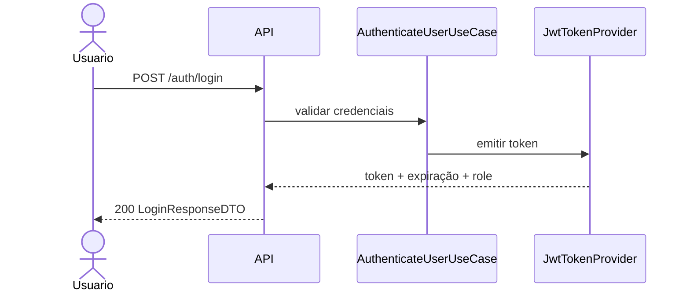
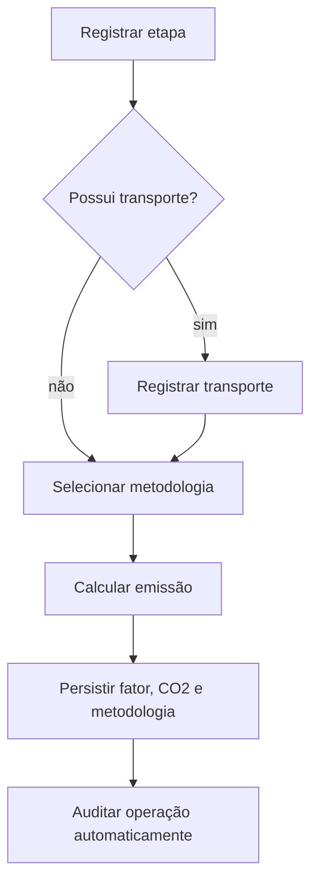

# spec.md — Supply Chain Verde API

> Especificação funcional: o que a API oferece e por quê, sem detalhar a implementação técnica. A arquitetura técnica fica no `plan.md` e o acompanhamento de execução no `tasks.md`.

## 1. Contexto

A Supply Chain Verde API oferece rastreabilidade de lotes, mensuração de emissões de CO₂ e governança ambiental para cadeias de suprimento sustentáveis. O sistema registra fornecedores, produtos, lotes e as etapas percorridas até o varejo, mantendo certificações e uma trilha de auditoria.

O backend serve o frontend web e também disponibiliza consultas públicas para consumidores que acessam a jornada de um lote por QR Code.

## 2. Perfis de usuário

| Perfil | Quem é | Acesso |
|---|---|---|
| Público | Consumidor ou auditor externo consultando um QR Code | Rastreabilidade e pegada de carbono públicas |
| `admin` | Administrador do sistema | Gestão completa |
| `manager` | Gestor da cadeia | Fornecedores, produtos, etapas e relatórios |
| `auditor` | Auditor ambiental ou de conformidade | Certificações, relatórios e auditoria |
| `supplier` | Fornecedor participante da cadeia | Próprios dados, certificações, lotes e etapas permitidas |

## 3. Capacidades funcionais

### 3.1 Autenticação e autorização

- Usuários entram com email e senha.
- A API valida a senha usando hash BCrypt e devolve um JWT com `userId`, `email` e `role`.
- Recursos protegidos exigem `Authorization: Bearer <token>`.
- A autorização é baseada nos perfis `admin`, `manager`, `auditor` e `supplier`.
- Login e consultas públicas de rastreabilidade/pegada de carbono não exigem autenticação.

### 3.2 Fornecedores e certificações

- Cadastrar, atualizar, consultar e listar fornecedores.
- Associar endereço e CNPJ validado ao fornecedor.
- Registrar certificações ambientais.
- Atualizar o status de uma certificação.
- Listar certificações de forma paginada por `page` e `size`; o filtro opcional `onlyExpiring=true` retorna somente as próximas do vencimento.
- A listagem paginada com `onlyExpiring` absorve a consulta específica de certificações próximas do vencimento.
- Calcular ranking de sustentabilidade sob demanda, sem persistir score derivado.

### 3.3 Produtos e lotes

- Cadastrar e atualizar produtos com categoria e unidade tipadas.
- Criar lotes vinculados a produto e fornecedor.
- Listar lotes de forma paginada por `page` e `size`, com filtro opcional `supplierId`; `admin`, `manager` e `auditor` podem consultar a coleção geral, enquanto `supplier` só pode consultar os próprios lotes.
- A listagem paginada com filtro de fornecedor absorve a consulta específica de lotes por fornecedor.
- Expor a rastreabilidade completa de um lote por endpoint público.

### 3.4 Etapas, transporte e emissões

- Registrar etapas de produção, armazenagem, transporte, distribuição ou varejo.
- Associar usuário responsável e endereços de origem/destino quando aplicável.
- Registrar transporte de uma etapa com modal, distância, combustível e capacidade.
- Calcular e persistir a emissão de carbono usando uma metodologia escolhida.
- Preservar o fator de emissão usado no momento do cálculo.
- Consultar a pegada de carbono consolidada de um lote publicamente.

### 3.5 Relatórios e auditoria

- Gerar relatório de sustentabilidade por fornecedor e período.
- Consultar relatórios em uma coleção paginada com filtro opcional `supplierId`, além de consultar um relatório individual.
- A coleção paginada substitui a listagem aninhada por fornecedor; `supplier` só pode consultar seus próprios relatórios.
- As respostas de relatório incluem CNPJ e razão social do fornecedor e total de lotes considerados, além do período, CO₂ total e data de geração.
- Registrar automaticamente ações relevantes por meio do interceptor de auditoria.
- Consultar logs de auditoria conforme o perfil autorizado.

## 4. Contratos HTTP principais

Base path: `/api/v1`. Todas as respostas usam JSON.

| Recurso | Operações | Acesso |
|---|---|---|
| Auth | `POST /auth/login` | Público |
| Users | `POST /users`, `GET /users/me`, `PATCH /users/{userId}/role` | `admin` ou autenticado |
| Suppliers | CRUD, ranking e lotes do fornecedor | Conforme RBAC |
| Certifications | `GET /certifications?page=0&size=20&onlyExpiring=false` paginada, criar e alterar status | `auditor`, `manager`, `admin` para consulta |
| Products | Criar, atualizar e listar | `admin`, `manager` ou autenticado |
| Batches | `GET /batches?page=0&size=20&supplierId={id}` paginada, criar e rastrear | Listagem geral: `admin`, `manager`, `auditor`; `supplier` consulta somente os próprios; rastreabilidade pública |
| Chains | Criar e listar etapas | Conforme RBAC |
| Transport | Registrar transporte de etapa | `supplier`, `manager`, `admin` |
| Emissions | Calcular emissão e consultar pegada do lote | Cálculo protegido; consulta pública |
| Reports | `GET /reports?limit=20&offset=0&supplierId={id}` paginada, `GET /reports/{reportId}` e `POST /suppliers/{supplierId}/reports` | Listagem global: `admin`, `manager`, `auditor`; `supplier` consulta somente os próprios |
| Audit logs | Listar histórico de ações | `admin`, `auditor` |

Os contratos detalhados de request/response permanecem documentados no `CLAUDE.md`, seção 10, e são a fonte de referência para controllers e consumidores.

## 5. Regras de negócio

1. Toda etapa possui usuário responsável.
2. Score de sustentabilidade não é armazenado; é calculado quando solicitado.
3. O lote é identificado publicamente pelo `batchId`; não há código de rastreamento adicional persistido.
4. Auditoria é transversal e automática; casos de uso não gravam `AuditLog` manualmente.
5. Endereços são entidades referenciadas, não texto duplicado em fornecedores ou etapas.
6. Toda emissão registra metodologia e fator vigente para manter histórico auditável.
7. Valores fechados usam enums tipados.
8. Perfis controlam autorização dos endpoints.
9. A exposição de IDs sequenciais em rotas públicas é um risco conhecido; rate limiting ou identificador público não sequencial são evoluções futuras.

## 6. Fluxos principais

### 6.1 Login

```mermaid
sequenceDiagram
    actor Usuario
    participant API
    participant Auth as AuthenticateUserUseCase
    participant JWT as JwtTokenProvider
    Usuario->>API: POST /auth/login
    API->>Auth: validar credenciais
    Auth->>JWT: emitir token
    JWT-->>API: token + expiração + role
    API-->>Usuario: 200 LoginResponseDTO
```

### 6.2 Rastreabilidade pública

```mermaid
flowchart TD
    A[QR Code com batchId] --> B[GET /batches/{id}/traceability]
    B --> C{Lote existe?}
    C -->|sim| D[Jornada + etapas + CO2]
    C -->|não| E[Erro HTTP padronizado]
```

### 6.3 Registro de etapa e emissão

```mermaid
flowchart TD
    A[Registrar etapa] --> B{Possui transporte?}
    B -->|sim| C[Registrar transporte]
    B -->|não| D[Selecionar metodologia]
    C --> D
    D --> E[Calcular emissão]
    E --> F[Persistir fator, CO2 e metodologia]
    F --> G[Auditar operação automaticamente]
```

## 7. Fora de escopo atual

- Refresh token.
- Exportação de relatórios em PDF/CSV.
- Rate limiting específico para os endpoints públicos.
- Identificador público UUID separado do ID interno.
- Painéis analíticos complexos; a API entrega os dados consolidados necessários.

## 10. Paginação

As rotas `GET /api/v1/batches` e `GET /api/v1/certifications` usam `page` zero-based e `size` (padrão 20, máximo 100), retornando os itens em `content` e os metadados `page`, `size`, `totalElements` e `totalPages`. Certificações aceitam `onlyExpiring` (padrão `false`) e lotes aceitam `supplierId` opcional.

As demais coleções paginadas que usam busca por deslocamento aceitam `limit` (padrão 20, máximo 100) e `offset` (padrão 0), retornam os itens em `items` e incluem `limit`, `offset` e `hasNext`. A listagem de relatórios também aceita `supplierId` opcional. A autorização por fornecedor deve ser aplicada no servidor: um usuário `supplier` não pode consultar dados de outro fornecedor alterando esse filtro.
