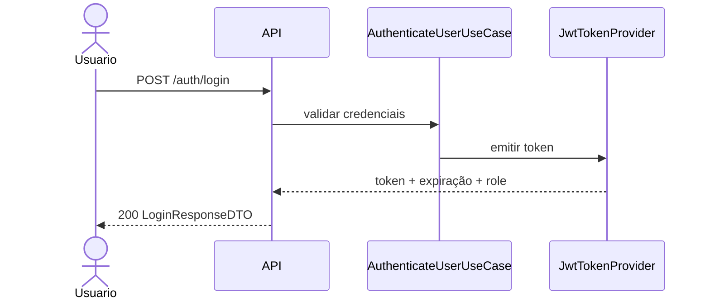
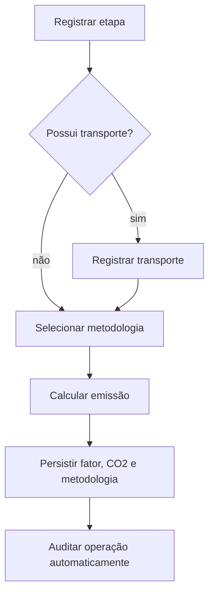

# spec.md — Supply Chain Verde API

> Especificação funcional: o que a API oferece e por quê, sem detalhar a implementação técnica. A arquitetura técnica fica no `plan.md` e o acompanhamento de execução no `tasks.md`.

## 1. Contexto

A Supply Chain Verde API oferece rastreabilidade de lotes, mensuração de emissões de CO₂ e governança ambiental para cadeias de suprimento sustentáveis. O sistema registra fornecedores, produtos, lotes e as etapas percorridas até o varejo, mantendo certificações e uma trilha de auditoria.

O backend serve o frontend web e também disponibiliza consultas públicas para consumidores que acessam a jornada de um lote por QR Code.

## 2. Perfis de usuário

| Perfil | Quem é | Acesso |
|---|---|---|
| Público | Consumidor ou auditor externo consultando um QR Code | Rastreabilidade e pegada de carbono públicas |
| `admin` | Administrador do sistema | Gestão completa |
| `manager` | Gestor da cadeia | Fornecedores, produtos, etapas e relatórios |
| `auditor` | Auditor ambiental ou de conformidade | Certificações, relatórios e auditoria |
| `supplier` | Fornecedor participante da cadeia | Próprios dados, certificações, lotes e etapas permitidas |

## 3. Capacidades funcionais

### 3.1 Autenticação e autorização

- Usuários entram com email e senha.
- A API valida a senha usando hash BCrypt e devolve um JWT com `userId`, `email` e `role`.
- Recursos protegidos exigem `Authorization: Bearer <token>`.
- A autorização é baseada nos perfis `admin`, `manager`, `auditor` e `supplier`.
- Login e consultas públicas de rastreabilidade/pegada de carbono não exigem autenticação.

### 3.2 Fornecedores e certificações

- Cadastrar, atualizar, consultar e listar fornecedores.
- Associar endereço e CNPJ validado ao fornecedor.
- Registrar certificações ambientais.
- Atualizar o status de uma certificação.
- Listar certificações de forma paginada por `page` e `size`; o filtro opcional `status` aceita qualquer valor de `CertificationStatus` (`ACTIVE`, `EXPIRED`, `SUSPENDED` ou `UNDER_REVIEW`).
- `GET /certifications/expiring` foi removida. Sem filtro de status, a listagem retorna certificações de todos os status, ordenadas por `issued_at` decrescente e `certificationId` decrescente como desempate.
- A listagem usa `page` zero-based (padrão `0`) e `size` (padrão `20`, máximo `100`) e rejeita parâmetros inválidos com `400`.
- Calcular ranking de sustentabilidade sob demanda, sem persistir score derivado.

### 3.3 Produtos e lotes

- Cadastrar e atualizar produtos com categoria e unidade tipadas.
- Listar produtos com `GET /products?limit=20&offset=0&search={termo}`, em páginas de até 100 itens. A busca full-text em português cobre nome e descrição; a categoria também pode ser pesquisada pelo código da API ou pelo rótulo em português, ignorando caixa e acentos. A resposta contém `{ items, limit, offset, hasNext, totalPages }`, com contagem após a busca, e mantém acesso autenticado.
- Criar lotes vinculados a produto e fornecedor.
- Listar lotes de forma paginada por `page` e `size`, com filtro opcional `supplierId`; `admin`, `manager` e `auditor` podem consultar a coleção geral, enquanto `supplier` consulta somente os próprios lotes. Como não há associação explícita entre usuário e fornecedor no modelo atual, adota-se a convenção de que o `userId` do token `SUPPLIER` é igual ao `supplierId`; o servidor ignora o filtro recebido desse perfil.
- A listagem paginada absorve a consulta específica de lotes por fornecedor, substituindo `GET /suppliers/{supplierId}/batches` após a migração do frontend.
- Expor a rastreabilidade completa de um lote por endpoint público.

### 3.4 Etapas, transporte e emissões

- Registrar etapas de produção, armazenagem, transporte, distribuição ou varejo.
- Associar usuário responsável e endereços de origem/destino quando aplicável.
- Registrar transporte de uma etapa com modal, distância, combustível e capacidade.
- Calcular e persistir a emissão de carbono usando uma metodologia escolhida.
- Preservar o fator de emissão usado no momento do cálculo.
- Consultar a pegada de carbono consolidada de um lote publicamente.

### 3.5 Relatórios e auditoria

- Gerar relatório de sustentabilidade por fornecedor e período.
- Consultar relatórios pela coleção `GET /reports`: sem `reportId`, retorna a coleção paginada com filtro opcional `supplierId`; com `reportId`, retorna o detalhe individual.
- A coleção paginada substitui a listagem aninhada por fornecedor; `supplier` só pode consultar seus próprios relatórios.
- As respostas de relatório incluem CNPJ e razão social do fornecedor e total de lotes considerados, além do período, CO₂ total e data de geração.
- Registrar automaticamente alterações de dados por triggers PostgreSQL em uma tabela de auditoria mantida pelo banco.
- Propagar o ID do usuário autenticado no contexto da transação; a API não cria linhas de auditoria e consulta os eventos persistidos pelo banco.
- Consultar logs de auditoria conforme o perfil autorizado.

### 3.6 Resumo do dashboard

- `GET /api/v1/dashboard/summary` retorna os indicadores globais e os lotes recentes para qualquer usuário autenticado, inclusive `supplier`.
- `activeBatches` conta lotes que têm etapas registradas e cuja etapa mais recente não é `RETAIL`. A etapa mais recente é determinada por `startedAt`, usando `chainId` como desempate; lotes sem etapas ficam fora da contagem.
- `expiringCertifications` conta certificações com vencimento entre hoje e os próximos 30 dias, inclusive, sem restringir pelo status.
- `suppliers` representa todos os fornecedores cadastrados. O domínio não possui um indicador de fornecedor ativo/inativo.
- `monthlyEmissionKgCo2e` soma as emissões do mês calendário atual usando `calculatedAt`; se não houver emissões no período, retorna zero.
- `recentBatches` aceita `limit` opcional, padrão `10` e máximo `100`. Os itens são ordenados por `producedAt` decrescente e depois por `batchId` decrescente. Cada item contém produto, fornecedor, quantidade, unidade e o `stage_type` da etapa mais recente como `status`. Lotes sem etapas não são listados; lotes em `RETAIL` podem constar como recentes, embora não sejam ativos.

## 4. Contratos HTTP principais

Base path: `/api/v1`. Todas as respostas usam JSON.

| Recurso | Operações | Acesso |
|---|---|---|
| Auth | `POST /auth/login` | Público |
| Users | `POST /users`, `GET /users?email={fragment}&limit=20&offset=0` retorna `{ items, limit, offset, hasNext, totalPages }`, `GET /users/me`, `PATCH /users/{userId}/role` | Listagem: `admin`; `/me`: autenticado |
| Suppliers | `GET /suppliers` lista fornecedores; `GET /suppliers?supplierId={id}` consulta um fornecedor; `GET /suppliers?ranked=true&limit=20&offset=0&search={termo}` retorna `{ items, limit, offset, hasNext, totalPages }`. Lista e ranking compartilham os campos `supplierId`, `name`, `cnpj`, `address`, `phone`, `registeredAt`, `sustainabilityScore`, `activeCertificationCount` e `totalCo2Kg` | Conforme RBAC |
| Certifications | `GET /certifications?page=0&size=20&status=ACTIVE` paginada com filtro opcional por status, criar e alterar status | `auditor`, `manager`, `admin` para consulta |
| Products | Criar, atualizar e listar; `GET /products?limit=20&offset=0&search={termo}` retorna `{ items, limit, offset, hasNext, totalPages }` | `admin`, `manager` ou autenticado |
| Batches | `GET /batches?page=0&size=20&supplierId={id}` paginada, criar e rastrear | Listagem: `admin`, `manager`, `auditor`; `supplier` consulta somente os próprios pelo `userId` do token; rastreabilidade pública |
| Chains | Criar e listar etapas | Conforme RBAC |
| Transport | Registrar transporte de etapa | `supplier`, `manager`, `admin` |
| Emissions | Calcular emissão e consultar pegada do lote | Cálculo protegido; consulta pública |
| Reports | `GET /reports?limit=20&offset=0&supplierId={id}` paginada com `{ items, limit, offset, hasNext, totalPages }`; `GET /reports?reportId={id}` retorna detalhe; `POST /suppliers/{supplierId}/reports` | Listagem global: `admin`, `manager`, `auditor`; `supplier` consulta somente os próprios |
| Audit logs | Triggers do PostgreSQL escrevem os eventos; a API expõe somente `GET /audit-logs?from={date}&to={date}&action={action}&userEmail={fragment}&limit=20&offset=0`, com `{ items, limit, offset, hasNext, totalPages }`; cada item inclui entidade e snapshots JSON; período inclusivo obrigatório, ação e email opcionais, ordenação por timestamp/ID decrescentes | `admin`, `auditor` |
| Dashboard | `GET /dashboard/summary?limit=10` — resumo global e lotes recentes | Qualquer usuário autenticado |

Os contratos detalhados de request/response estão em [`reference.md`](reference.md), neste documento e nos DTOs/OpenAPI da API.

## 5. Regras de negócio

1. Toda etapa possui usuário responsável.
2. Score de sustentabilidade não é armazenado; é calculado quando solicitado.
3. O lote é identificado publicamente pelo `batchId`; não há código de rastreamento adicional persistido.
4. O PostgreSQL é responsável por gravar auditoria via triggers. A API define `app.user_id` na transação antes da primeira escrita; não há interceptor nem repositório de aplicação que insira logs.
5. Endereços são entidades referenciadas, não texto duplicado em fornecedores ou etapas.
6. Toda emissão registra metodologia e fator vigente para manter histórico auditável.
7. Valores fechados usam enums tipados.
8. Perfis controlam autorização dos endpoints.
9. A exposição de IDs sequenciais em rotas públicas é um risco conhecido; rate limiting ou identificador público não sequencial são evoluções futuras.

### 5.1 Auditoria mantida pelo PostgreSQL

- Triggers por linha nas tabelas de negócio registram `INSERT`, `UPDATE` e `DELETE` na tabela `audit_log`; updates sem mudança efetiva não geram evento. Atualizações que alterem os campos de estado definidos para a entidade usam `STATUS_CHANGE`.
- A tabela mantém `log_id`, `user_id`, `action`, `affected_table`, `affected_entity_id`, `before_data`, `after_data` e `performed_at`. Os snapshots são JSONB, incluem apenas colunas alteradas e representam FKs como IDs. Campos de autenticação, hashes, tokens e outros segredos são excluídos por lista explícita nas funções de trigger.
- `INSERT` grava `before_data = NULL` e os dados auditáveis em `after_data`; `DELETE` faz o inverso; `UPDATE`/`STATUS_CHANGE` grava somente as chaves alteradas nos dois snapshots. Valores são obtidos de `OLD`/`NEW`, nunca reconstruídos a partir do estado atual.
- Antes da primeira escrita da requisição, a API define `app.user_id` com `set_config('app.user_id', :userId, true)` dentro da transação que fará a escrita. O terceiro argumento `true` torna o valor local à transação: não se usa variável de sessão persistente nem cache compartilhado entre requisições.
- A definição do contexto e todas as escritas auditadas devem compartilhar a mesma transação e conexão física. Escritas sem ator autenticado recebem identidade de serviço definida para o processo ou ator nulo conforme política; não podem herdar identidade de outra transação.
- `app.user_id` é contexto propagado pela API, não uma identidade autenticada independentemente pelo banco. A conexão do banco é privada à aplicação; clientes não recebem credenciais SQL. A role de aplicação não pode inserir, atualizar ou excluir diretamente linhas de `audit_log`; triggers usam uma função controlada, com `search_path` fixo e privilégios mínimos.
- A tabela nova inicia vazia. O histórico da tabela substituída não é copiado; essa perda é deliberada e deve constar no release/migration notes. Seeds não devem inventar eventos de negócio; somente operações executadas após a instalação das triggers entram na trilha.
- A API mantém a consulta paginada e autorização de `GET /api/v1/audit-logs`. O frontend não envia `userId` para auditar; apenas apresenta `userId`/email retornados e os snapshots recebidos.

O desenho e suas consequências operacionais estão registrados em [`adr/0001-auditoria-no-postgresql.md`](adr/0001-auditoria-no-postgresql.md).

## 6. Fluxos principais

### 6.1 Login

```mermaid
sequenceDiagram
    actor Usuario
    participant API
    participant Auth as AuthenticateUserUseCase
    participant JWT as JwtTokenProvider
    Usuario->>API: POST /auth/login
    API->>Auth: validar credenciais
    Auth->>JWT: emitir token
    JWT-->>API: token + expiração + role
    API-->>Usuario: 200 LoginResponseDTO
```

### 6.2 Rastreabilidade pública

```mermaid
flowchart TD
    A[QR Code com batchId] --> B[GET /batches/{id}/traceability]
    B --> C{Lote existe?}
    C -->|sim| D[Jornada + etapas + CO2]
    C -->|não| E[Erro HTTP padronizado]
```

### 6.3 Registro de etapa e emissão

```mermaid
flowchart TD
    A[Registrar etapa] --> B{Possui transporte?}
    B -->|sim| C[Registrar transporte]
    B -->|não| D[Selecionar metodologia]
    C --> D
    D --> E[Calcular emissão]
    E --> F[Persistir fator, CO2 e metodologia]
    F --> G[Auditar operação automaticamente]
```

## 7. Fora de escopo atual

- Refresh token.
- Exportação de relatórios em PDF/CSV.
- Rate limiting específico para os endpoints públicos.
- Identificador público UUID separado do ID interno.
- Painéis analíticos complexos; a API entrega os dados consolidados necessários.

## 10. Paginação

As rotas `GET /api/v1/batches` e `GET /api/v1/certifications` usam `page` zero-based e `size` (padrão 20, máximo 100), retornando os itens em `content` e os metadados `page`, `size`, `totalElements` e `totalPages`. Certificações aceitam `status` opcional; lotes aceitam `supplierId` opcional.

As demais coleções paginadas que usam busca por deslocamento aceitam `limit` (padrão 20, máximo 100) e `offset` (padrão 0), retornam os itens em `items` e incluem `limit`, `offset`, `hasNext` e `totalPages`. O total de páginas é calculado com todos os resultados que correspondem aos filtros (email, busca, ação, intervalo e/ou fornecedor); retorna `0` quando não há resultados. A listagem de relatórios também aceita `supplierId` opcional. A autorização por fornecedor deve ser aplicada no servidor: um usuário `supplier` não pode consultar dados de outro fornecedor alterando esse filtro.
